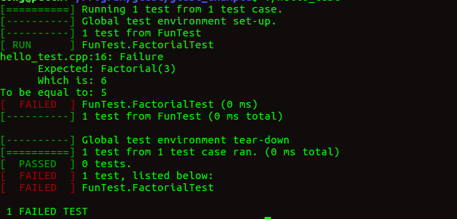

# 前言 

>​    由于项目越来越大，为了提高程序的稳定性，决定引入单元测试。最后确定使用谷歌**googletest**开源单元测试框架。本文主要介绍googletest框架属性以及在linux平台编译、简单使用。

单元测试框架的了解（来自知乎）：

* [单元测试到底是什么？应该怎么做？](https://www.zhihu.com/question/28729261)

* [各位都是怎么进行单元测试的？](https://www.zhihu.com/question/27313846)

# 一、googletest框架简介

​	C++单元测试框架有cppunit, boost.Test googletest等等，而googletest（简称gtest）是比较丰富并且跨平台。

​	详细了解这个框架参考官方：https://github.com/google/googletest

**平台支持**

- Linux
- Mac OS X
- Windows
- Cygwin
- MinGW
- Windows Mobile
- Symbian
- PlatformIO

**框架属性**

- An [xUnit](https://en.wikipedia.org/wiki/XUnit) test framework.
- Test discovery.
- A rich set of assertions.
- User-defined assertions.
- Death tests.
- Fatal and non-fatal failures.
- Value-parameterized tests.
- Type-parameterized tests.
- Various options for running the tests.
- XML test report generation.


# 二、在linux上编译googletest

googletest项目地址：https://github.com/google/googletest

* **下载gtest**

我下载了**googletest-release-1.8.0**版本，解压之后发现包含两个模块：gtest和gmock (googlemock，这个模块使用场景，在一些需要模拟数据的情景下)

* **编译gtest**

参考/googletest/README.md文件，提供了三种编译方式: 命令行直接编译、make和cmake。我选择了直接编译。如下所示${GTEST_DIR}变量替换为当前路径googletest目录（尽量使用决定路径）。

直接编译googletest/src/gtest-all.cc文件再打包为静态库。（-pthread 可知gtest是多线程实现）

```shell
 g++ -isystem ${GTEST_DIR}/include -I${GTEST_DIR} \
        -pthread -c ${GTEST_DIR}/src/gtest-all.cc
 ar -rv libgtest.a gtest-all.o
```

使用make方式编译

```shell
cd ${GTEST_DIR}/make
make
./sample1_unittest
```

使用cmake方式编译, 编译添加gtest_build_samples=ON宏，可以将测试samples编译进来。

最后一句替换为：cmake -Dgtest_build_samples=ON ${GTEST_DIR}

```shell
mkdir mybuild       
cd mybuild
cmake ${GTEST_DIR}  
```


#  三、googletest简单使用

gtest自带10个测试用例，非常值得学习：https://github.com/google/googletest/tree/master/googletest/samples

每个测试用例展示主要测试点同：

- Sample #1 shows the basic steps of using googletest to test C++ functions.
- Sample #2 shows a more complex unit test for a class with multiple member functions.
- Sample #3 uses a test fixture.
- Sample #4 teaches you how to use googletest and `googletest.h` together to get the best of both libraries.
- Sample #5 puts shared testing logic in a base test fixture, and reuses it in derived fixtures.
- Sample #6 demonstrates type-parameterized tests.
- Sample #7 teaches the basics of value-parameterized tests.
- Sample #8 shows using `Combine()` in value-parameterized tests.
- Sample #9 shows use of the listener API to modify Google Test's console output and the use of its reflection API to inspect test results.
- Sample #10 shows use of the listener API to implement a primitive memory leak checker.

简单测试程序

```
// hello_test.cpp

#include <gtest/gtest.h>

int Factorial(int n) {
  int result = 1;
  for (int i = 1; i <= n; i++) {
    result *= i;
  }
  return result;
}
//简单测试函数
TEST(FunTest, FactorialTest) {
	EXPECT_EQ(Factorial(1), 1);
	EXPECT_EQ(Factorial(2), 2);
	EXPECT_EQ(Factorial(3), 5);
	EXPECT_EQ(Factorial(8), 40320);
}

int main(int argc, char **argv) {
  ::testing::InitGoogleTest(&argc, argv);
  return RUN_ALL_TESTS();
}
```

运行结果如下：（效果不错）




# 四、googletest学习

推荐从源头学习，效率高。

主要参考官网：https://github.com/google/googletest

编译参考：https://github.com/google/googletest/blob/master/googletest/README.md

学习gtest的基本用法：https://github.com/google/googletest/blob/master/googletest/docs/primer.md

学习gtest的高级用法：https://github.com/google/googletest/blob/master/googletest/docs/advanced.md

gtest的10个样例：https://github.com/google/googletest/blob/master/googletest/docs/samples.md


# 五、小结

​	本次项目组安排我引入单元测试框架，本次了解分为几个步骤，总的大概花了2天时间完成。

* 了解C++的单元测试框架。（这个过程也看了handy库自己实现了单元测试的源码，对单元测试理解更深）
* 选择googletest测试框架。开源、好用、跨平台。
* 在linux编译googletest
* 学习googletest的基本用法以及测试用例（这个过程时间长一些，将近一天）
* 将googletest引入我们的项目。

