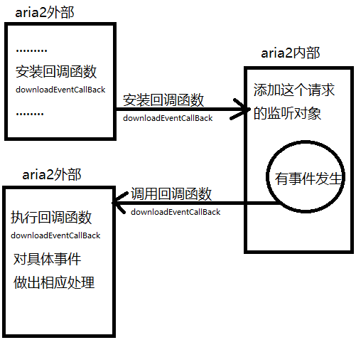
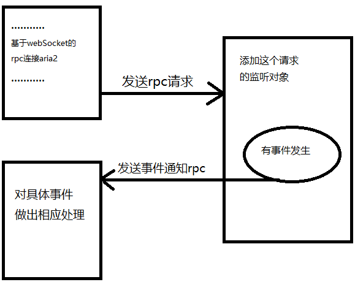
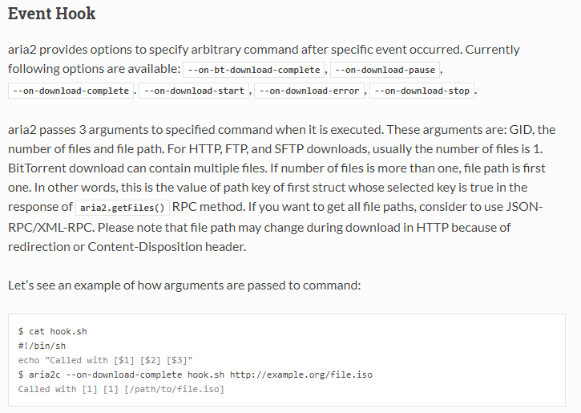

# 前言

 本文主要是整理一下aria2库事件机制，再结合源码简要分析。

# 1、aria2事件机制简介

aria2内部事件发生时，会通知其监听者。 主要有以下两种监听者。

（1）外部API（内部事件发生，通知外层，主要通过回调函数实现）

（2）基于webSocket的rpc。（内部事件发生，通过rpc将消息通知对方）

(note: 基于webSocket的rpc，服务器有能力主动发消息给客户端)。


# 2、 aria2事件类型

aria2的事件类型如下。即当aria2发生以下事件时， 会通知aria2对应的监听者。

```cpp
enum DownloadEvent {
  /**
   * Indicating download has started.
   */
  EVENT_ON_DOWNLOAD_START = 1,
  /**
   * Indicating download has paused.
   */
  EVENT_ON_DOWNLOAD_PAUSE,
  /**
   * Indicating download has stopped.
   */
  EVENT_ON_DOWNLOAD_STOP,
  /**
   * Indicating download has completed.
   */
  EVENT_ON_DOWNLOAD_COMPLETE,
  /**
   * Indicating download has stopped because of the error.
   */
  EVENT_ON_DOWNLOAD_ERROR,
  /**
   * Indicating BitTorrent download has completed, but it may still
   * continue to perform seeding.
   */
  EVENT_ON_BT_DOWNLOAD_COMPLETE
};
```


# 3、aria2事件机制图解

（1）外部API事件监听触发方式，如下图3-1所示（以下图使用windows自带画图工具，不是很专业）



<center>图3-1  外部API事件图解</center>

（2）基于webSocket的rpc监听触发方式，如图3-2所示。



<center>图3-2 基于webSocket的rpc事件图解</center>

# 4、aria2事件机制源码分析

Notifier是单例对象，主要维护所有监听对象listeners_， 当有事件发生，就将事件通过notifyDownloadEvent推送给监听者。而不同的监听者对事件的响应不同， 主要由DownloadEventListener对应的派生类完成具体事件的响应onEvent。

```cpp
//事件监听者
struct DownloadEventListener {
  virtual ~DownloadEventListener() = default;
  virtual void onEvent(DownloadEvent event, const RequestGroup* group) = 0;
};

//事件通知者(单例模式, 通知所有事件的监听者)
class Notifier {
public:
  Notifier();
  ~Notifier();
  void addDownloadEventListener(DownloadEventListener* listener);
  // Notifies the download event to all listeners.
  void notifyDownloadEvent(DownloadEvent event, const RequestGroup* group);

  void notifyDownloadEvent(DownloadEvent event,
                           const std::shared_ptr<RequestGroup>& group)
  {
    notifyDownloadEvent(event, group.get());
  }

private:
  std::vector<DownloadEventListener*> listeners_;  //下载事件监听器。
};
```

## （1）对于API外层形式的事件实现

1. 在刚开始启动aria2的时候， 通过配置信息，初始化回调函数为downloadEventCallback。然后将配置对象config传递到sessionNew中。

```c++
 aria2::Session* session;
  // Create default configuration. The libaria2 takes care of signal
  // handling.
  aria2::SessionConfig config;
  // Add event callback
  config.downloadEventCallback = downloadEventCallback;
  session = aria2::sessionNew(aria2::KeyVals(), config);
```

默认的回调函数实现（这个可以根据具体需要对具体事件进行处理）

```
int downloadEventCallback(aria2::Session* session, aria2::DownloadEvent event,
                          aria2::A2Gid gid, void* userData)
{
  switch (event) {
  case aria2::EVENT_ON_DOWNLOAD_COMPLETE:
    std::cerr << "COMPLETE";
    break;
  case aria2::EVENT_ON_DOWNLOAD_ERROR:
    std::cerr << "ERROR";
    break;
  default:
    return 0;
  }
  std::cerr << " [" << aria2::gidToHex(gid) << "] ";
  aria2::DownloadHandle* dh = aria2::getDownloadHandle(session, gid);
  if (!dh)
    return 0;
  if (dh->getNumFiles() > 0) {
    aria2::FileData f = dh->getFile(1);
    // Path may be empty if the file name has not been determined yet.
    if (f.path.empty()) {
      if (!f.uris.empty()) {
        std::cerr << f.uris[0].uri;
      }
    }
    else {
      std::cerr << f.path;
    }
  }
  aria2::deleteDownloadHandle(dh);
  std::cerr << std::endl;
  return 0;
}
```

在sessionNew中，使用外层提供的回调函数创建一个监听对象ApiCallbackDownloadEventListener（API形式监听对象，继承DownloadEventListener）。 然后将这个对象安装到单例事件通知对象Notifier中。

````cpp
Session* sessionNew(const KeyVals& options, const SessionConfig& config)
{
    ...........
        
    //创建一个事件监听者, 这主要是针对api的方式.
    if (config.downloadEventCallback)
    {
      session->listener = make_unique<ApiCallbackDownloadEventListener>(session.get(), config.downloadEventCallback, config.userData);
      //构建一个下载事件通知对象Notifier
      SingletonHolder<Notifier>::instance()->addDownloadEventListener(session->listener.get());
    }
    
   .............
  return session.release();
}
````

2.当aria2内部触发事件的时候，事件通知者通知监听对象。 （比如内部触发EVENT_ON_DOWNLOAD_START事件， 开始下载的时候触发）在RequestGroupMan::fillRequestGroupFromReserver中，当一个资源启动下载的时候，会调用notifyDownloadEvent通知监听对象“EVENT_ON_DOWNLOAD_START（启动下载）事件”。最终会调用单例对象Notifier通知所有监听者。

```cpp
void RequestGroupMan::fillRequestGroupFromReserver(DownloadEngine* e)
{  
    //...........	
    //安装下载完成调用的脚本
    //aria2提供Event Hook，  当下载完成可以执行相关命令，可以执行相关的脚本文件。
    util::executeHookByOptName(groupToAdd, e->getOption(),  PREF_ON_DOWNLOAD_START);
    //通知启动下载开始， 启动下载开始的通知，这会通知（eg， 在rpc中，会通过websocket协议，将启动     //下载的消息，通过ws_lay发送给rpc客户端）
    //或者在程序中使用api调用方式，那么启动下载将会调用相应的回调函数。详细看session类
    notifyDownloadEvent(EVENT_ON_DOWNLOAD_START, groupToAdd);
    //...............
}
```

```cpp
void notifyDownloadEvent(DownloadEvent event,
                         const std::shared_ptr<RequestGroup>& group)
{
  // Check NULL to make unit test easier.
  //获取Notifier的单例对象.
  if (SingletonHolder<Notifier>::instance()) {
	  //通知事件event给所有监听者.
    SingletonHolder<Notifier>::instance()->notifyDownloadEvent(event, group);
  }
}
```

```cpp
void Notifier::notifyDownloadEvent(DownloadEvent event,
                                   const RequestGroup* group)
{
  for (auto listener : listeners_)
  {
    listener->onEvent(event, group);
  }
}
```

3.监听者DownloadEventListener对相应事件的处理，取决于具体派生类的实现。在这里以API形式ApiCallbackDownloadEventListener对象。对消息相应的具体如下。 其中callback_函数即是一开始初始化在API外层提供的downloadEventCallback函数。

```cpp
void ApiCallbackDownloadEventListener::onEvent(DownloadEvent event,
                                               const RequestGroup* group)
{
  callback_(session_, event, group->getGID(), userData_);
}
```

## （2）对于基于websocket的rpc形式的事件实现

1. 在开始启动下载引擎之前，在MultiUrlRequestInfo::prepare()中判断是否支持rpc. 如果支持那么创建一个WebSocketSessionMan监听对象。并且将这个对象添加到事件通知对象Notifier中。
    （note: WebSocketSessionMan主要维护webSocket集合， 只要有连接到达，才会将此连接以session添加到WebSocketSessionMan中。  当前为空。）

```cpp

int MultiUrlRequestInfo::prepare()
{

   //......
   //判断是否支持webSockekt
#ifdef ENABLE_WEBSOCKET
    //创建事件监听者, 这主要是针对rpc方式.
    if (option_->getAsBool(PREF_ENABLE_RPC))   //判断是否启动rpc
    {
      e_->setWebSocketSessionMan(make_unique<rpc::WebSocketSessionMan>());
      SingletonHolder<Notifier>::instance()->addDownloadEventListener(e_->getWebSocketSessionMan().get());
    }
#endif // ENABLE_WEBSOCKET
  //........
}
```

2. 当rpc服务器监听到有websocket连接的时候，会将这个连接以WebSocketSession对象添加到WebSocketSessionMan中。在HttpServerCommand::execute()，rpc服务器中，收到来自websocket的连接，创建WebSocketResponseCommand命令。

```cpp
bool HttpServerCommand::execute()
{
      //....................................
      if (header->fieldContains(HttpHeader::UPGRADE, "websocket") &&header->fieldContains(HttpHeader::CONNECTION, "upgrade"))
      {
        //如果是websocket
#ifdef ENABLE_WEBSOCKET
        int status = websocketHandshake(header.get());
        if (status == 101) {
          std::string serverKey = createWebSocketServerKey(header->find(HttpHeader::SEC_WEBSOCKET_KEY));
          httpServer_->feedUpgradeResponse(
              "websocket",
              fmt("Sec-WebSocket-Accept: %s\r\n", serverKey.c_str()));
          e_->addCommand(make_unique<rpc::WebSocketResponseCommand>(
              getCuid(), httpServer_, e_, socket_));
        }
      }
      //........................................
}
```

WebSocketResponseCommand命令在应答完成客户端的消息之后，会执行WebSocketResponseCommand::afterSend，在这个方法里面创建了WebSocketSession对象，并且以WebSocketSession对象又创建一个WebSocketInteractionCommand命令。

```cpp
void WebSocketResponseCommand::afterSend(
    const std::shared_ptr<HttpServer>& httpServer, DownloadEngine* e)
{
  auto wsSession = std::make_shared<WebSocketSession>(httpServer->getSocket(),
                                                      getDownloadEngine());
  auto command = make_unique<WebSocketInteractionCommand>(
      getCuid(), wsSession, e, wsSession->getSocket());
  wsSession->setCommand(command.get());
  e->addCommand(std::move(command));
}
```

在WebSocketInteractionCommand构造函数中，将WebSocketSession对象添加到WebSocketSessionMan中。

```
WebSocketInteractionCommand::WebSocketInteractionCommand(
    cuid_t cuid, const std::shared_ptr<WebSocketSession>& wsSession,
    DownloadEngine* e, const std::shared_ptr<SocketCore>& socket)
    : Command(cuid),
      e_(e),
      socket_(socket),
      writeCheck_(false),
      wsSession_(wsSession)
{
  e_->getWebSocketSessionMan()->addSession(wsSession_);
  e_->addSocketForReadCheck(socket_, this);
}
```

3. 当有事件发生的时候，通过rpc主动通知客户端。会通过WebSocketSessionMan对象通知所有基于websocket连上rpc。

```cpp
void WebSocketSessionMan::onEvent(DownloadEvent event,
                                  const RequestGroup* group)
{
  addNotification(getMethodName(event), group);
}
```

构造消息发送rpc客户端，从这个方法可看出，第二个参数表示具体事件event。

```cpp
void WebSocketSessionMan::addNotification(const std::string& method,
                                          const RequestGroup* group)
{
  auto dict = Dict::g();
  dict->put("jsonrpc", "2.0");
  dict->put("method", method);
  auto eventSpec = Dict::g();
  eventSpec->put("gid", GroupId::toHex((group->getGID())));
  auto params = List::g();
  params->append(std::move(eventSpec));
  dict->put("params", std::move(params));
  std::string msg = json::encode(dict.get());
  //对所有sessions_发送消息.
  for (auto& session : sessions_)
  {
	//Adds text message |msg|. The message is queued and will be sent in onWriteEvent(). msg消息将会被发送。
    session->addTextMessage(msg, false);
    session->getCommand()->updateWriteCheck();
  }
}
```

# 5、aria2的hook event

> hooks就像一些外来的钩子，在源代码之间钩取（窃听）一些信息，当它捕捉到自己感兴趣的事发生，就拦截下来，让自己的代码执行一下(或者开起另外一个进程)，处理一下这个信息，等待这个消息处理完或者直接执行之前的进程。这样就可以在不用改变源代码的情况下，做一些别的事情，比方说监控、分析和一些恶意的事。

对于aria2来说，当有事件发生时，可以有选择执行hook程序，对于这些事件称为hook event。aria2对于hook event的处理，开启另外一个进程执行hook程序（如果aria2有指定hook event对应的hook程序的话）。

aria2的官方文档也有介绍，如下图5-1所示。



<center>图5-1 hook事件官方文档</center>

下面简单介绍hook event的源码实现。

如下所示， 当有事件（参数pref指定，eg：on-download-start），会执行参数pref指定的hook程序（如果有的话）。下面cmd便是对应hook event的hook程序，如果cmd不为空，那么最后会执行executeHook程序。

```cpp
void executeHookByOptName(const std::shared_ptr<RequestGroup>& group,
                          const Option* option, PrefPtr pref)
{
  executeHookByOptName(group.get(), option, pref);
}

//通过名称pref，命令执行相关的hook event。
void executeHookByOptName(const RequestGroup* group, const Option* option,
                          PrefPtr pref)
{
	//获取对应的hook event事件名称
  const std::string& cmd = option->get(pref);
  if (!cmd.empty())
  {
	  //获取对应资源的下载上下文对象。
    const std::shared_ptr<DownloadContext> dctx = group->getDownloadContext();
    std::string firstFilename;
    size_t numFiles = 0;

    //如果文件下载只是保存到内存，还没保存到硬盘
    if (!group->inMemoryDownload())
    {
      std::shared_ptr<FileEntry> file = dctx->getFirstRequestedFileEntry();
      if (file)  //获取保存文件的路径名称
      {
        firstFilename = file->getPath();
      }
      //计算下载文件数量
      numFiles = dctx->countRequestedFileEntry();
    }
    executeHook(cmd, group->getGID(), numFiles, firstFilename);
  }
}
```

在executeHook程序中。使用fork开启另外一个进程执行hook程序cmd(这是linux的实现方式， windows最终使用CreateProcessW开启另外一个进程执行hook程序)。注意此时还携带了执行hook程序的参数。

```cpp
void executeHook(const std::string& command, a2_gid_t gid, size_t numFiles,
                 const std::string& firstFilename)
{
 //获取对应资源的gid.
  const std::string gidStr = GroupId::toHex(gid);
  //对应资源的文件数量
  const std::string numFilesStr = util::uitos(numFiles);

#ifndef __MINGW32__   //对于非mingw编译器。
  A2_LOG_INFO(fmt("Executing user command: %s %s %s %s", command.c_str(),
                  gidStr.c_str(), numFilesStr.c_str(), firstFilename.c_str()));
  pid_t cpid = fork();
  //开启子进程处理用户完成的hook event。
  if (cpid == 0) {
    // child!
    execlp(command.c_str(), command.c_str(), gidStr.c_str(),
           numFilesStr.c_str(), firstFilename.c_str(),
           reinterpret_cast<char*>(0));
    perror(("Could not execute user command: " + command).c_str());
    _exit(EXIT_FAILURE);
    return;
  }

```

# 6、总结

从以上可以看出aria2事件机制相对比较简单，不过在实现方面还是有很多地方值得学习，比如如何在内部维护通知者和各个监听者。 通知者使用了单例对象，监听者对位派生对象，对具体事件具体处理。

# 7、参考

1. [hook事件理解](https://www.zhihu.com/question/20610442)
2. [hook event官方文档](https://aria2.github.io/manual/en/html/aria2c.html#event-hook)


