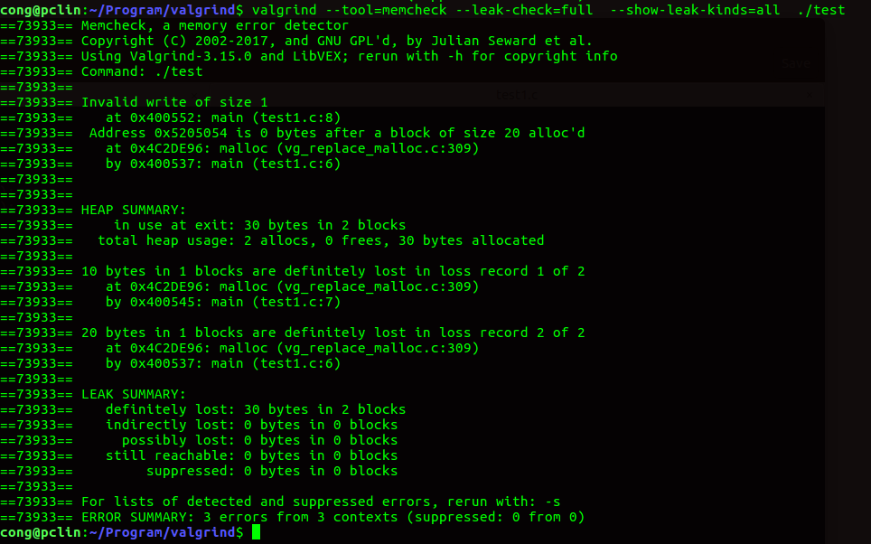
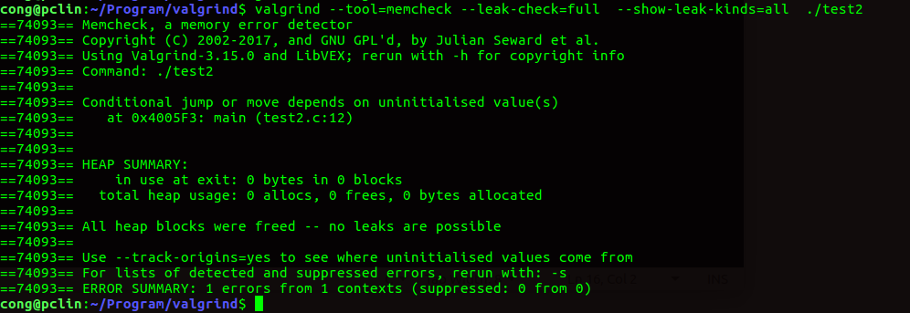
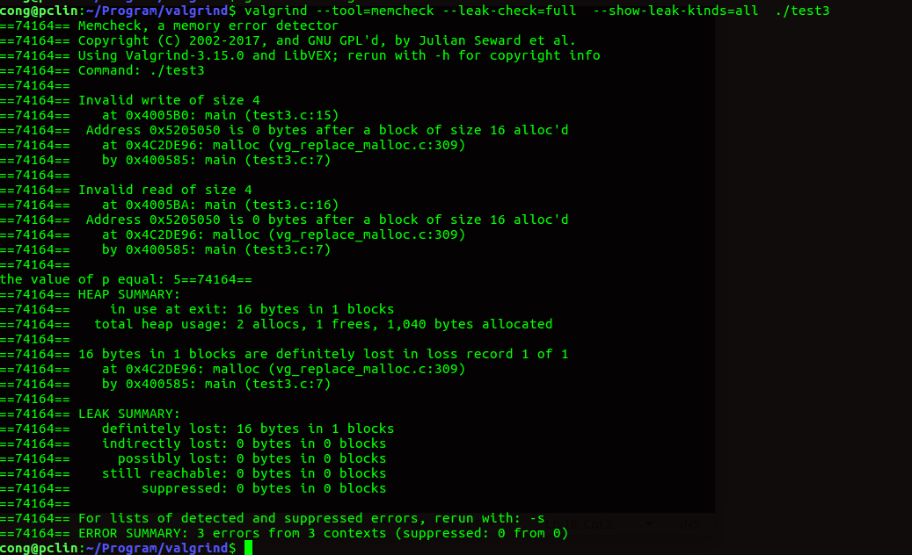
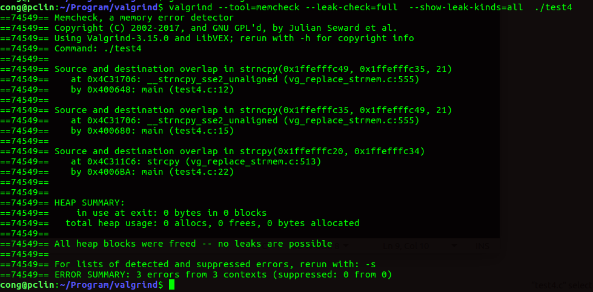
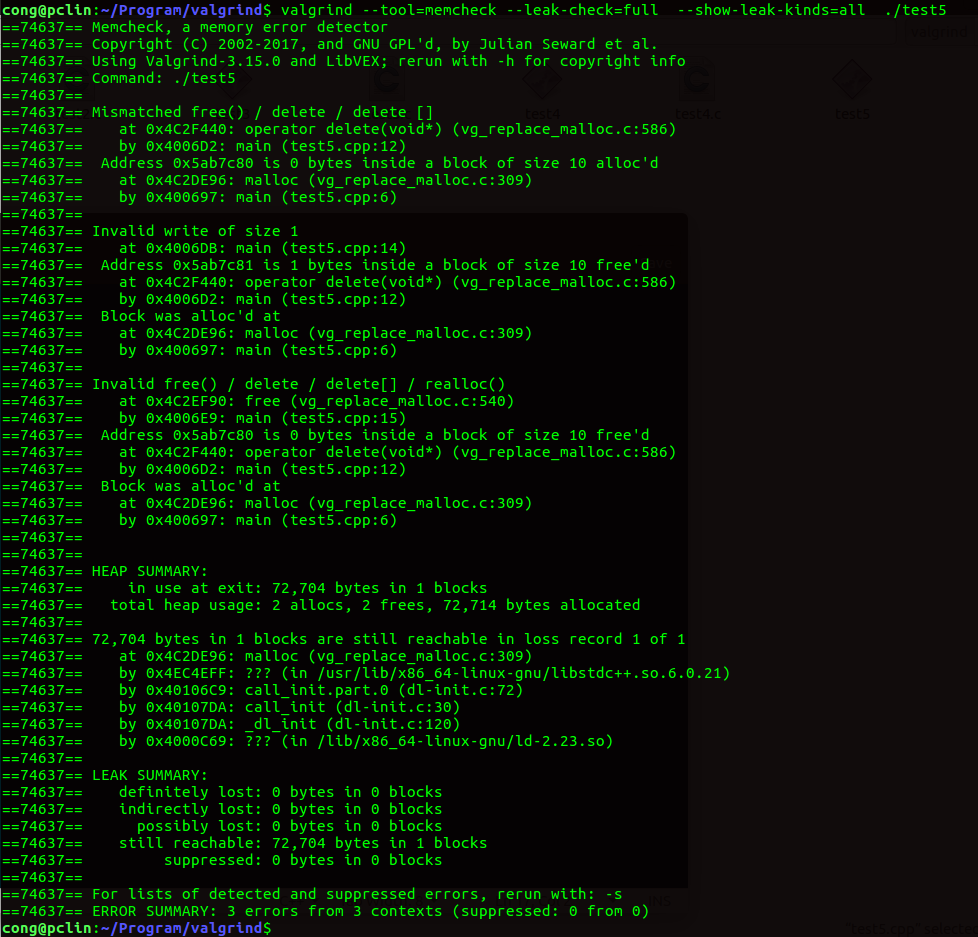
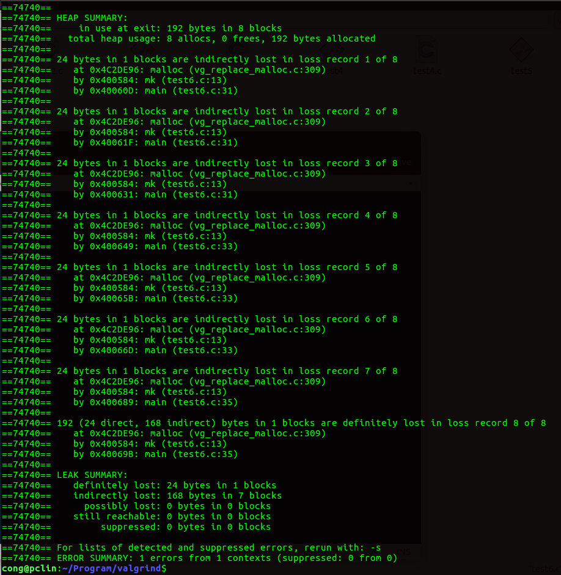
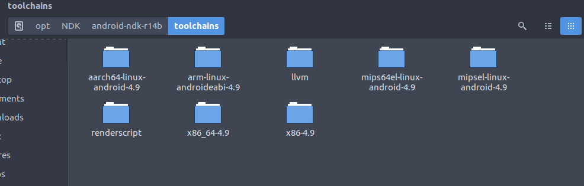

# 前言

>由于最近项目需要检测C/C++代码方面的内存。因此就研究了几个检测工具，最终确定了使用valgrind。本文主要介绍Valgrind的使用，在linux上以及在android native上检测内存。

# 一、valgrind的概念原理以及使用

主要参考IBM上关于Valgrind使用介绍:[应用 Valgrind 发现 Linux 程序的内存问题](https://www.ibm.com/developerworks/cn/linux/l-cn-valgrind/)。在此不再叙述。

# 二、在linux上使用valgrind检测例子

虽然这部分内容基本来自上面的文章，这里再做记录也是为了记录学习过程。

## (1)在linux上编译最新valgrind

1.在官方下载最新版本的valgrind:[官方最新valgrind版本](<http://www.valgrind.org/downloads/current.html>)

2.根据下载文件中**README**指示编译，很简单。

3.编译完成测试

```bash
valgrind --version
valgrind-3.15.0  （输出版本）
```

## (2) 在linux上使用valgrind测试例子

###  1. 数组越界

程序: test1.c

```cpp
#include<stdio.h>
#include<stdlib.h>
#include<string.h>
int main(){

	char* c = (char*)malloc(sizeof(char)*20);
	char* d = (char*)malloc(sizeof(char)*10);
	c[20]='a';
	return 0;
}
```

note: 编译检测注意事项（后续测试例子依然使用这种方法）

​	编译检测： 编译务必加上**-g**选项。（-g表示增加调试信息，检测内存才有更多信息输出）

```bash
gcc test1.c -g -o test
```

​	检测使用**memcheck**工具，**--leak-check=full**(检测内存泄漏)，**--show-leak-kinds=all**(将所有内存泄漏消息都显示)

```
valgrind --tool=memcheck --leak-check=full  --show-leak-kinds=all  ./test
```

数组越界检测结果如图2-1所示：**程序行8越界写入, 以及在行6，7分配了30字节内存，都没有分配**



<center>图2-1 数组越界检测结果</center>
### 2.使用未初始化内存

程序：test2.c

```cpp
#include<stdio.h>

int main(void){

	int a[5];
	int i,s;
	a[0]=a[1]=a[3]=a[4]=0;
	s = 0;
	for(i=0;i<5;++i){
		s+=a[i];
	}
	if(s == 377){
		printf("sum is = %d\n",s);
	}
	return 0;
}
```

检测结果如图2-2所示：**程序行12指出未初始化变量s, 其主要在使用s变量的时候，检测到s的赋值，a[2]存在未初始化，导致s的值也不确定。**



<center>图2-2 使用未初始化内存检测结果</center>
### 3. 内存读写越界

程序：test3.c

```cpp
#include<stdlib.h>
#include<stdio.h>

int main(){

	int len=4;
	int* pt = (int*)malloc(len*sizeof(int));
	
	int *p = pt;

	for(int i =0; i < len;++i){
		++p;
	}
	//over
	*p = 5;
	printf("the value of p equal: %d", *p);
	return 0;
}
```

检测结果如图2-3所示：**程序行15检测到越界写内存，程序行16检测到越界读内存，并且这个内存都在行7分配，最终也没有释放。一共泄漏了16个字节。**



<center>图2-3 内存读写越界检测结果</center>
### 4. 内存覆盖

程序：test4.c

```cpp
#include<stdio.h>
#include<stdlib.h>
#include<string.h>
int main(){

	char x[50];
	for(int i = 0; i <50 ; ++i){
		x[i]=i+1;
	}

	strncpy(x+20,x,20);  //ok
	strncpy(x+20,x,21);  //overlap
	
	strncpy(x,x+20,20);  //ok
	strncpy(x,x+20,21);  //overlap

	x[39]='\0';
	strcpy(x,x+20);      //ok
	
	x[39]=39;
	x[40]='\0';
	strcpy(x,x+20);      //overlap

	return 0;
}
```

检测结果如下图2-4所示。**程序行12，15，22都指出内存覆盖（overlap）**



<center>图2-4 内存覆盖检测结果</center>
### 5.动态内存管理错误

程序：test5.cpp

```cpp
#include<stdio.h>
#include<stdlib.h>

int main(){

	char* p = (char* )malloc(10);
	char* pt=p;
	for(int i=0; i<10; ++i){
		p[i] = 'z';
	}

	delete p;

	pt[1]='x';
	free(pt);
	return 0;
}
```

检测结果如图2-5所示。**程序中出现不正确使用malloc/free new/delete.   在程序中使用malloc，却使用delete释放内存。程序行12，15报的就是这种错误，程序行14 写入无效内存（虽然使用delete不正确释放内存，但是对改内存写入也回报错）。**



<center>图2-5 动态内存管理错误检测结果</center>
### 6. 内存泄漏类型

程序：test6.c

```cpp
#include<stdio.h>
#include<stdlib.h>

typedef struct _node{
	struct _node *l;
	struct _node *r;
	char v;

} node;

node* mk(node* l, node* r, char val){

	node* f = (node* )malloc(sizeof(node));
	f->l = l;
	f->r = r;
	f->v =val;
	return f;
}
void nodefr(node* n){
	if(n){
		nodefr(n->l);
		nodefr(n->r);
		free(n);
	}
}


int main(){

	node* t1,*t2,*t3;
	t1=mk(mk(mk(0,0,'3'),0,'2'),0,'1');

	t2=mk(0,mk(0,mk(0,0,'6'),'5'),'4');

	t3=mk(mk(t1,t2,'8'),0,'7');
	return 0;
}
```

检测结果如图2-6所示。**程序中是生成一棵树的过程，每个节点大小12字节（考虑内存对齐），共8个节点。上述程序所有节点都被泄漏。 Memcheck内存泄漏分为2中，一种可能是内存泄漏（Possibly lost）, 即指仍然存在某个指针能够访问该内存，但该指针已经不是该内存的首地址。 另一种是确定的内存（Definitely lost），即指已经不能够访问这个内存。 Definitely lost又分为两种: 直接的（direct）和间接的（indirect）, 它们区别是直接是没有任何指针指向该内存， 间接是指指向该内存的指针都位于内存泄漏处。 在上述中，只有根节点是directly lost, 其他节点都是indirectly lost。**



<center>图2-6  内存泄漏类型检测结果</center>


# 三、在android上使用valgrind检测

## (1)交叉编译valgrind版本

**编译一定要参考README.android， 经过多次测试，在真机和许多版本环境中，测试不成功， 这个花费了挺长时间。最终再模拟器arm 4.1 版本上测试成功**。

**安装交叉编译gcc**

以下已经安装了x86, arm版本。如下图3-1所示。（安装过程自行寻找资料）



<center>图3-1 android上交叉编译器</center>
**编译valgrind脚本**

根据valgrind中具体平台的**README.android写build.sh**，显示x86版本版本。 arm版本响应修改即可。（脚本ANDROID_HOME变量：/opt/NDK/android-ndk-r14b,如图3-1所示路径）。

```bash
#!/bin/sh

export NDKROOT=$ANDROID_HOME
export HWKIND=generic
TOOLCHAIN=$ANDROID_HOME/toolchain

export AR=$NDKROOT/toolchains/x86-4.9/prebuilt/linux-x86_64/bin/i686-linux-android-ar
export LD=$NDKROOT/toolchains/x86-4.9/prebuilt/linux-x86_64/bin/i686-linux-android-ld
export CC=$NDKROOT/toolchains/x86-4.9/prebuilt/linux-x86_64/bin/i686-linux-android-gcc

CPPFLAGS="--sysroot=$NDKROOT/platforms/android-9/arch-x86" \
   CFLAGS="--sysroot=$NDKROOT/platforms/android-9/arch-x86 -fno-pic" \
   ./configure --prefix=/data/local/Inst \
   --host=i686-android-linux --target=i686-android-linux \
   --with-tmpdir=/sdcard

make -j8
make -j8 install DESTDIR=`pwd`/valgrind
```

## (2) 如何在valgrind启动一个Android应用程序进行测试

具体参考：

​	(1)[Can't run a Java Android program with Valgrind](https://stackoverflow.com/questions/13531496/cant-run-a-java-android-program-with-valgrind/19235439#19235439)

​	(2)[移植Valgrind检测Android JNI内存泄漏](https://www.cnblogs.com/kuliuheng/p/10600737.html)

note:

  1.添加环境变量**VALGRIND_LIB**,指向valgrind存在的目录，例如下面。

```
export VALGRIND_LIB="/data/local/Inst/lib/valgrind"
```

 	2. 将启动脚本valgrind.sh拷贝到android手机，**特别注意 脚本换行符问题， 比如windows和android换行符不一致。**
 	3. 参考第一个链接， 如果**bootstrap_valgrind.sh**脚本不能顺利执行，直接一行一行在adb中完成也行。

## (3) 简单测试。

直接在adb shell中输入测试ls命令。如果正确，说明valgrind可以在android上使用。

```bash
valgrind --tool=memcheck --leak-check=full  --show-leak-kinds=all  ls
```


# 四、总结

主要熟悉了valgrind工具使用， 本次使用该工具大部分时间花在将工具搬移到android中测试ndk中的c/c++代码。

android不是所有平台都支持valgrind， 测试了很多版本，最终发现模拟器arm 4.1支持，踩了很多坑。

# 五、参考

1.[Valgrind Native 内存检测](https://aheadsnail.github.io/2019/07/20/Valgrind-Native-%E5%86%85%E5%AD%98%E6%A3%80%E6%B5%8B/)

2.[Can't run a Java Android program with Valgrind](https://stackoverflow.com/questions/13531496/cant-run-a-java-android-program-with-valgrind/19235439#19235439)

3.[移植Valgrind检测Android JNI内存泄漏](https://www.cnblogs.com/kuliuheng/p/10600737.html)


