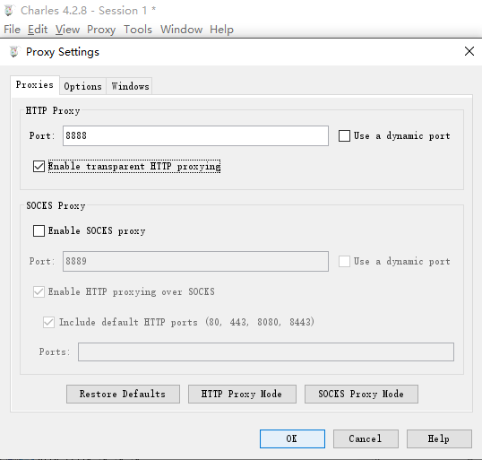
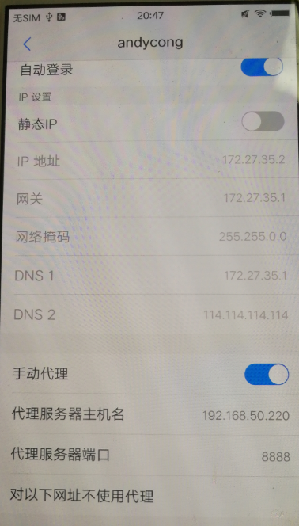
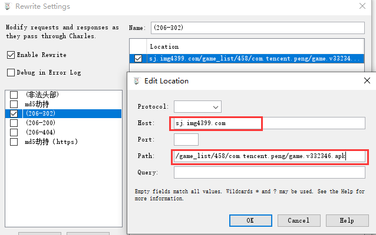
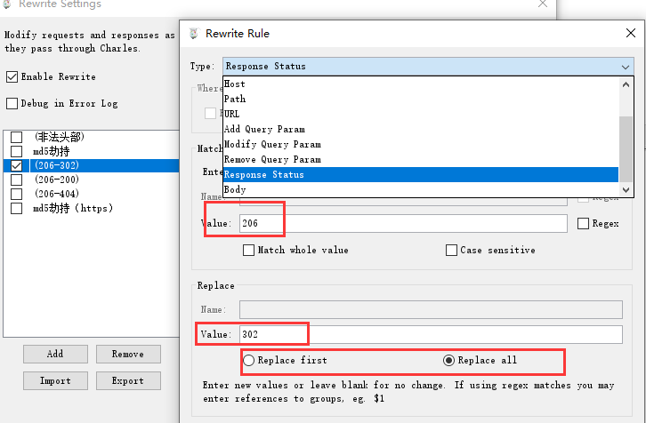
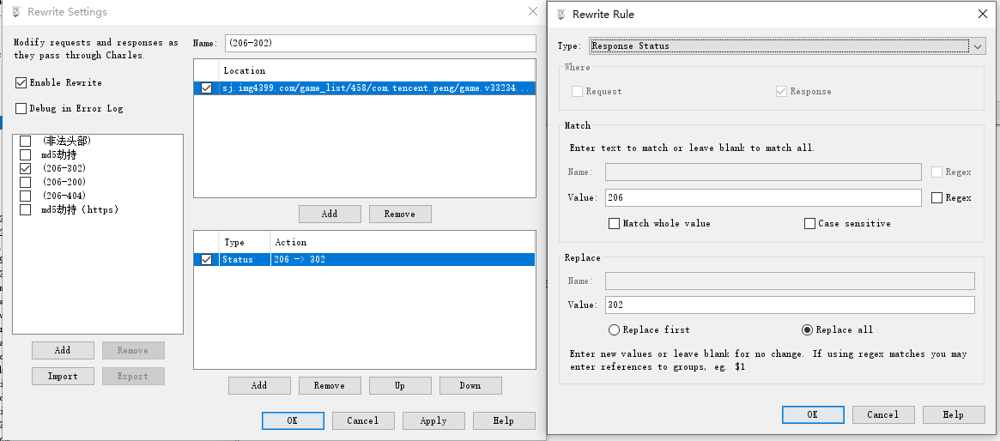
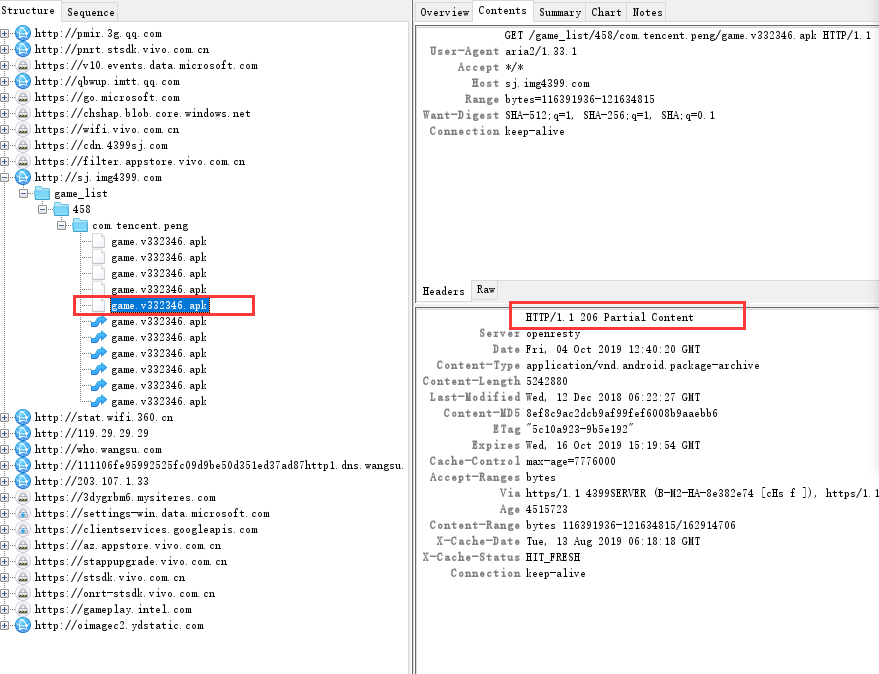
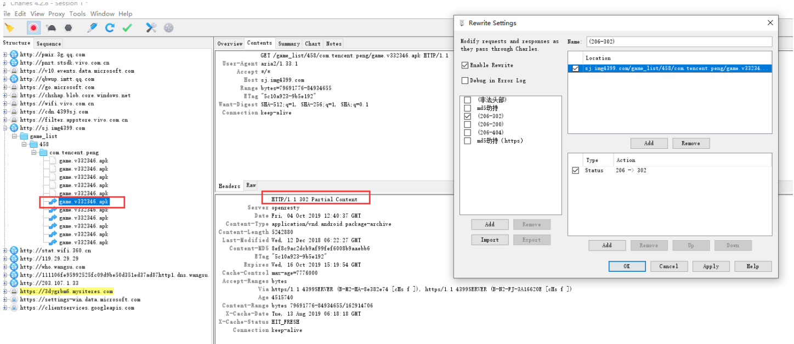
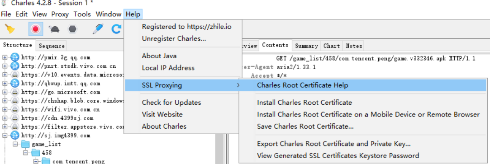

# 前言

> 我们的应用程序需要通过**http/https**协议访问资源，然而http/https访问的**uri连接**可能被劫持，劫持之后可能会篡改http/https连接**响应状态码或者头部信息**，为此我们希望程序能有足够健壮性，遇到这些情况程序可以试别并且正常处理，不至于程序终止。因此，我们希望利用**charles**代理服务器可以模拟http/https劫持，并且篡改部分信息，帮助测试应用程序使用http访问资源信息被篡改之后，程序依旧可以稳定运行。

**原理可以参考另外一篇:** [浅谈dns解析与劫持](https://andycong.top/2019/10/29/%E6%B5%85%E8%B0%88dns%E8%A7%A3%E6%9E%90%E4%B8%8E%E5%8A%AB%E6%8C%81/#more)

# 一、配置环境

​	(1)下载charles 4.28, [官方下载地址](https://www.charlesproxy.com/download/) （此乃收费软件，免费使用的话，每半个小时中断一次而已）

note: [charles破解参考](https://blog.csdn.net/qq_25821067/article/details/79848589)

​	(2)安装charles 4.28 在windows 10操作系统上。

​	(3)应用程序在android上运行, 那么需要将手机与charles处于同一个网段（因此windows 10上使用无线网卡开启wifi, android手机连接这个wifi。其他情况应当灵活配置，让应用程序和charles处于同个网段即可，这样charles就可以抓到应用程序的包）

​	(4)开启charles监听，如下图所示， 如果charles所在主机192.168.50.220， 那么本机将在**192.168.50.220:8888 **监听http的包。（Proxy->proxy setting）

​	(5)android手机开启代理, 设置如下图。

# 二、charles劫持篡改http信息

（1）charles如果要劫持特定的uri以及篡改此http请求和响应信息， 需要经过简单的配置。打开**tools->Rewrite**

如下图指定劫持uri:http://sj.img4399.com/game_list/458/com.tencent.peng/game.v332346.apk , （需要将host和path分开配置）。

配置需要篡改此uri的信息，如下图。像下面修改状态码（将响应状态码从206修改为302），另外我们可以看到，除了修改应答状态码（Response Status）， 还有好多信息可以修改。

因此对此uri劫持以及响应状态码(从206修改为302)的修改整体配置如下图。点击下面**Apply**按钮即可开始劫持并篡改。

（2）在上面的配置基础上，通过在charles抓包，分析劫持前后的对比。

劫持之前如下图所示。

劫持之后如下图所示。

# 三、在charles配置抓取https包

由于https具有一定加密，因此charles无法直接抓取https对应的包信息，需要安装证书以及简单配置，然后篡改https信息和http一致。

(1) 在charles上安装证书，windwos，操作：Help->SSL Proxying->Install Charles Root Certificate。

（2）在android手机上安装证书。 操作：首先在charles上设置，Help->SSL Proxying->Install Charles Root Certificate on a Mobile Device or Remote Browser，会给出具体的安装步骤，如下图。

按照charles指示要求，在android手机上，配置代理为：172.27.35.1:8888.  使用浏览器访问**chls.pro/ssl**安装证书。（我在androids使用firefox完成了证书的安装）。

（3）然后再将手机代理设置回charles所在主机的地址，即192.168.50.220:8888(charles主机)。

（4）另外https需要将uri中host域名添加到ssl中。Proxy->SSL Proxy Settings，如下图所示。

(5)接下来想劫持篡改https信息，就跟操作http一样。

# 四、总结

本文主要简单阐述了如何使用charles代理服务器抓取http包并且篡改包的信息。通过本次操作，更加熟悉charles工具以及对http协议更加了解，有效帮助测试了程序使用http协议被劫持之后的稳定性。

# 五、参考

(1)[Windows下用Charles对Android抓包HTTPS](https://blog.csdn.net/ybdesire/article/details/80636248)

