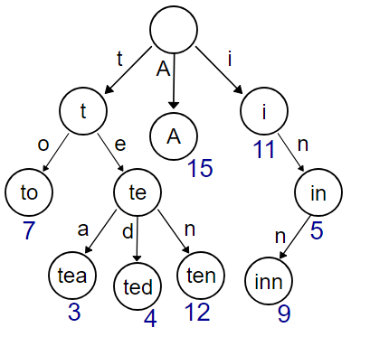
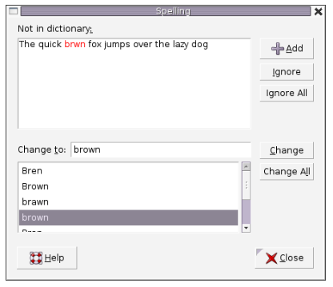
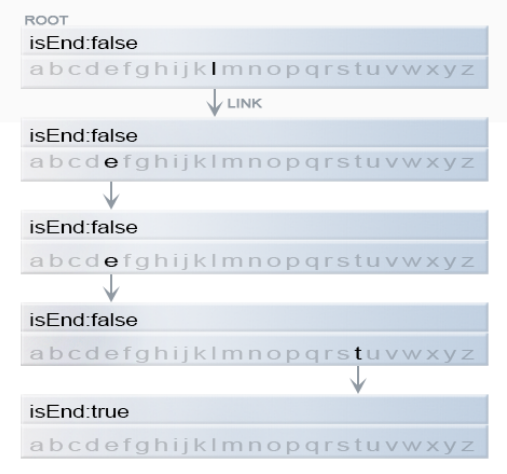
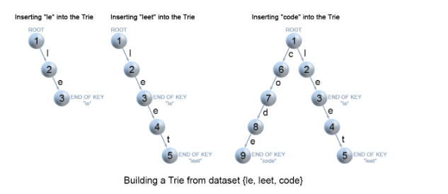
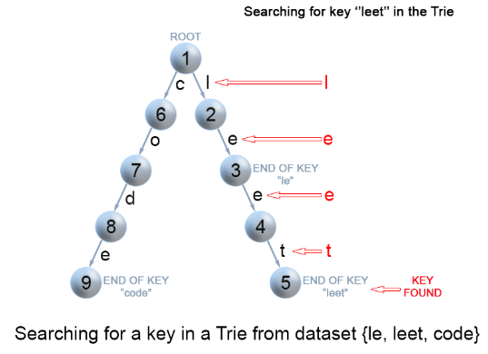

  

# 前言

> 　　前阵子在leetcode刷题过程中了解了前缀树的数据结构，决定在此记录。本文主要是介绍前缀树（Trie）的基本概念以及优缺点（trade-off）和其应用场景，最后使用C++代码简单描述了前缀树的基本操作。

# 1、前缀树的定义

**前缀树的定义引用维基百科**

>　　在[计算机科学](https://zh.wikipedia.org/wiki/%E8%AE%A1%E7%AE%97%E6%9C%BA%E7%A7%91%E5%AD%A6)中，trie，又称前缀树或字典树，是一种有序[树](https://zh.wikipedia.org/wiki/%E6%A0%91_(%E6%95%B0%E6%8D%AE%E7%BB%93%E6%9E%84))，用于保存[关联数组](https://zh.wikipedia.org/wiki/%E5%85%B3%E8%81%94%E6%95%B0%E7%BB%84)，其中的键通常是[字符串](https://zh.wikipedia.org/wiki/%E5%AD%97%E7%AC%A6%E4%B8%B2)。与[二叉查找树](https://zh.wikipedia.org/wiki/%E4%BA%8C%E5%8F%89%E6%9F%A5%E6%89%BE%E6%A0%91)不同，键不是直接保存在节点中，而是由节点在树中的位置决定。一个节点的所有子孙都有相同的[前缀](https://zh.wikipedia.org/wiki/%E5%89%8D%E7%BC%80)，也就是这个节点对应的字符串，而根节点对应[空字符串](https://zh.wikipedia.org/wiki/%E7%A9%BA%E5%AD%97%E7%AC%A6%E4%B8%B2)。一般情况下，不是所有的节点都有对应的值，只有叶子节点和部分内部节点所对应的键才有相关的值。trie中的键通常是字符串，但也可以是其它的结构。trie的算法可以很容易地修改为处理其它结构的有序序列，比如一串数字或者形状的排列。

直观观察前缀树结构可能更容易理解上面所讲定义，以下列举一个例子。
　　如图1-1是一个前缀树例子，每一个键（key）是多个字符组成的单词，每一个字符对应一个节点，每一个单词末尾字符节点包含一个数值（这个数值可能是这个单词出现的频率），此数值在此可以暂时忽略， 图1-1只是为了展示Trie的结构。


​                                                   

<center>图1-1 一个保存了8个键的trie结构，分别为"A", "to", "tea", "ted", "ten", "i", "in", and "inn".</center>

   # 2、前缀树三个基本特性

> 1）根节点不包含字符，除根节点外每一个节点都只包含一个字符。
> 2）从根节点到某一节点，路径上经过的字符连接起来，为该节点对应的字符串。
> 3）每个节点的所有子节点包含的字符都不相同。

# 3、前缀树的核心思想

**使用空间换取时间，利用字符串的公共前缀来降低查询时间的开销以达到提高效率的目的。**

# 4、前缀树的优缺点(trade-off)

**优点：最大限度减少无谓字符串比较，插入和查询效率高。**
**缺点：trie树的空间内存消耗大。**

# 5、前缀树与其他结构比较

　　例如有一个包含n(n超过100万)个字符串的集合，每个字符串长度（m）不超过10，现在我们想在这个字符串集合中寻找某一个特定字符串， 找到则返回第一次出现的位置，否则返回空。

1） 假如此时我们使用二叉搜索树，那么其搜索时间复杂度O(mlogn), 当n增大时候，其搜索效率也会下降许多
2） 如果使用哈希表，对于100万数据，选用合适的哈希函数，其哈希collision概率低，因此其搜索复杂度基本是常数级别O(1)。如果数据是静态的（没有动态增加）,此时使用哈希结构是比较合适的， 因为我们提前知道哈希数据集合大小，用perfect hashing或者cuckoohashing可以达到collision概率最小，构建完hash table之后对给定字符串进行查询几乎肯定是一次搞定。然而如果有大量数据插入时，为了降低collision概率，只能增大哈希表， 必须重新构建哈希表， 性能极度下降。
3） 使用Tier结构，那么其搜索效率O(m), m是字符串长度， 并且其也可以高效插入新的数据，主要缺点是内存占用比较大，另外Tier树的深度也不能太深（在此为字符串长度），不然其搜索性能也会下降。 

**note: Trie可以进一步完善**

>  　　我们可以通过对Trie的内部节点进行压缩以提高内存使用率，比如“a”->"b"->"c"这三个连续的节点（a是b的父节点，b是c的父节点），"a"与"b"这两个节点均只有唯一的子节点，那么就可以很轻易的把"abc"合并为一个节点.

# 6、前缀树的应用领域

> 其应用领域主要是在集合中搜索包含关键字key前缀的字符串集合,这充分利用了Trie的优势。

1） google的搜索自动补充共功能，如搜索引擎上输入搜索关键词“google sea”, 可以自动返回前缀相同的关键词，如图6-1所示。


<center>图6-1 Google Suggest in action</center>

2） 单词拼写，当单词拼写出错的时候，可以自动检测并且给出相关正确单词提示。如图6-2所示。



<center>图6-2 A Spell checker used in word processor</center>

# 7、使用C++实现Trie的基本操作

## 7.1 Trie结构节点信息

Trie是一颗有根的树，它的节点一般具有如下字段：
1）**最多有R个节点的数组**。 每个节点最多拥有R个节点，或者节点为空。
2）**一个bool类型的字段。** 表示对应节点是否为key的末尾，或者只是这个key的前缀(key在这里可以理解为一个单词)
　　下图7-1为表示key为**“leet”**的Trie结构（假设R为26，并且假设字符由26个小写字母组成，后面代码实现也是基于这个假设，在这个基础上进行扩展并不困难）。



<center>图7-1 Representation of a key "leet" in trie</center>

C++表示Trie节点代码如下：

```c++
class TrieNode {
public:
    TrieNode(): isEnd_(false){
        for(int i =0 ; i < R ; ++i){
            links[i] = nullptr;
        }	
    }
    bool containsKey(char ch) {
        return links[ch -'a'] != nullptr;
    }
    TrieNode* get(char ch) {
        return links[ch -'a'];
    }
    void put(char ch, TrieNode* node) {
        links[ch -'a'] = node;
    }
    void setEnd() {
        isEnd_ = true;
    }
    bool isEnd() {
        return isEnd_;
    }
public:
    //R links to node children
    static const int R = 26;
    TrieNode* links[R];
    bool isEnd_;
};
```

## 7.2 在Trie中插入一个key

　　我们通过搜索Trie而插入一个键key，从根节点root开始并搜索一个每字符，该节点对应于key的第一个字符，有两种情况。如图7-2插入key所示。
1)   如果这个节点存在，我们将沿着这节点继续向下搜索下一个字符。
2）如果这个节点不存在，那么我们将为这个字符创建一个新节点，继续向下搜索直到key所有字符都在Trie。



 <center>图7-2  Insertion of keys into a trie.</center>

C++实现代码如下：

```c++
class Trie {
public:
    Trie() {
        root = new TrieNode();
    }

    // Inserts a word into the trie.
    void insert(string word) {
        TrieNode* itNode = root;
        for(auto& it :  word){
            if(!itNode->containsKey(it)){
                TrieNode* tmpNode = new TrieNode();
                itNode->put(it,tmpNode);
            }
            itNode = itNode->get(it);
        }
        itNode->setEnd();
    }
private:
    TrieNode* root;
};
```

插入key的复杂度:
　　1）时间复杂度O(m), m表示字符串的长度.
　　2)   空间复杂度O(m), 最坏的情况下需要创建m个新节点。

## 7.3 在Trie中搜索key或者前缀key	

　　每个key在Trie中表示为从根到内部节点或叶子的路径。我们从第一个关键字符的root开始，检查当前节点是否与key字符对应，有如下两种情况。如图7-3搜索key所示。
　　1）如果当前字符对应节点存在， 那么获取key下一个字符，在trie中继续向下遍历。
　　2）如果当前字符对应的节点不存在，返回空。
　　搜索key 返回的结果不为空， 如果其节点被标记为isEnd， 说明在trie中存在key。 如果节点没有标记为isEnd， 说明此key只是Trie结构中某元素的前缀而已。搜索key返回结果为空，说明Trie中不存在key这样的路径。



<center>图7-3 Search for a key in a trie</center>

C++实现代码如下：

```c++
class Trie{
public:
    //..........

    //search a prefix or whole key in trie and
    //returns the node where search ends
    TrieNode* searchPrefix(string word) {
        TrieNode* itNode = root;
        for(auto& it :  word){
            if(itNode->containsKey(it)){
                itNode = itNode->get(it);
            }else
                return nullptr;

        }
        return itNode;
    }
    // Returns if the word is in the trie.
    bool search(string word){
        TrieNode* itNode=searchPrefix(word);
        return itNode!=nullptr && itNode->isEnd();
    }

    // Returns if there is any word in the trie
    // that starts with the given prefix.
    bool startsWith(string prefix) {
        TrieNode* itNode=searchPrefix(prefix);
        return itNode != nullptr;
    }
private:
	TrieNode* root;	
};
```

搜索key或者搜索key前缀的复杂度：
　　1）时间复杂度O(m), m表示字符串的长度。
　　2）空间复杂度O(1)。

 ## 7.4 C++简单实现Trie完整代码

```c++
class Trie {
public:
    //注意嵌套类定义顺序有关。TrieNode变量的定义需要放在其声明后面
    class TrieNode {
    public:
        TrieNode(): isEnd_(false){
            for(int i =0 ; i < R ; ++i){
                links[i] = nullptr;
            }	
        }
        bool containsKey(char ch) {
            return links[ch -'a'] != nullptr;
        }
        TrieNode* get(char ch) {
            return links[ch -'a'];
        }
        void put(char ch, TrieNode* node) {
            links[ch -'a'] = node;
        }
        void setEnd() {
            isEnd_ = true;
        }
        bool isEnd() {
            return isEnd_;
        }
    public:
        // R links to node children
        static const int R = 26;
        TrieNode* links[R];
        bool isEnd_;
    };
    /** Initialize your data structure here. */
    Trie() {
        root = new TrieNode();
    }
    // Inserts a word into the trie
    void insert(string word) {
        TrieNode* itNode = root;
        for(auto& it :  word){
            if(!itNode->containsKey(it)){
                TrieNode* tmpNode = new TrieNode();
                itNode->put(it,tmpNode);
            }
            itNode = itNode->get(it);
        }
        itNode->setEnd();
    }
    //search a prefix or whole key in trie and
    //returns the node where search ends
    TrieNode* searchPrefix(string word) {
        TrieNode* itNode = root;
        for(auto& it :  word){
            if(itNode->containsKey(it)){
                itNode = itNode->get(it);
            }else
                return nullptr;

        }
        return itNode;
    }
    // Returns if the word is in the trie.
    bool search(string word){
        TrieNode* itNode=searchPrefix(word);
        return itNode!=nullptr && itNode->isEnd();
    }

    // Returns if there is any word in the trie
    // that starts with the given prefix.
    bool startsWith(string prefix) {
        TrieNode* itNode=searchPrefix(prefix);
        return itNode != nullptr;
    }
private:
    TrieNode* root;	
};
int main(){
    Trie wd;
    wd.insert("abc");
    cout<<wd.search("ab")<<endl;   	
    cout<<wd.search("abc")<<endl;   		
    cout<<wd.startsWith("ab")<<endl;
    cout<<wd.startsWith("abc")<<endl;
    return 0;
}
```

# 8、使用map实现内存高效的Trie

　　在上面我们可以看出，每一个节点都需要提前分配R个指针空间，然而每个指针并非都有指向数据，因此当数据量大时，这会浪费足够的空间（当然，如果所有指针都指向有效节点，那将充分利用了空间，最理想的情况，可惜事情并没有这么完美）。 因此我们希望每个节点中存储孩子节点的指针，当需要对应的孩子节点时再创建指针指向新的节点，而不是提前分配。
　　我们使用使用map关联容器，当需要创建节点的时候再分配空间存储，而不是提前预分配。这样确实可以节省内存，但是使用map性能下降（万事没有太完美）。

C++使用map结构实现Trie:

```c++
#include <iostream>
#include <unordered_map>
using namespace std;

// A Trie node
struct Trie
{
	// true when node is a leaf node
	bool isLeaf;

	// each node stores a map to its child nodes
	unordered_map<char, Trie*> map;
};

// Function that returns a new Trie node
Trie* getNewTrieNode()
{
	Trie* node = new Trie;
	node->isLeaf = false;

	return node;
}

// Iterative function to insert a string in Trie.
void insert(Trie*& head, char* str)
{
	if (head == nullptr)
        head = getNewTrieNode();

	// start from root node
	Trie* curr = head;
	while (*str)
	{
		// create a new node if path doesn't exists
		if (curr->map.find(*str) == curr->map.end())
			curr->map[*str] = getNewTrieNode();

		// go to next node
		curr = curr->map[*str];

		// move to next character
		str++;
	}

	// mark current node as leaf
	curr->isLeaf = true;
}

// returns true if given node has any children
bool haveChildren(Trie const* curr)
{
	// don't use (curr->map).size() to check for children

	for (auto it : curr->map)
		if (it.second != nullptr)
			return true;

	return false;
}

// Recursive function to delete a string in Trie.
bool deletion(Trie*& curr, char* str)
{
	// return if Trie is empty
	if (curr == nullptr)
		return false;

	// if we have not reached the end of the string
	if (*str)
	{
		// recurse for the node corresponding to next character in
		// the string and if it returns true, delete current node
		// (if it is non-leaf)
		if (curr != nullptr &&  curr->map.find(*str) != curr->map.end() &&
			deletion(curr->map[*str], str + 1) && curr->isLeaf == false)
		{
		    if (!haveChildren(curr))
			{
				delete curr;;
				curr = nullptr;
				return true;
			}
			else {
				return false;
			}
		}
	}

	// if we have reached the end of the string
	if (*str == '\0' && curr->isLeaf)
	{
		// if current node is a leaf node and don't have any children
		if (!haveChildren(curr))
		{
			delete curr;; // delete current node
			curr = nullptr;
			return true; // delete non-leaf parent nodes
		}

		// if current node is a leaf node and have children
		else
		{
			// mark current node as non-leaf node (DON'T DELETE IT)
			curr->isLeaf = false;
			return false;	   // don't delete its parent nodes
		}
	}

	return false;
}

// Iterative function to search a string in Trie. It returns true
// if the string is found in the Trie, else it returns false
bool search(Trie* head, char* str)
{
	// return false if Trie is empty
	if (head == nullptr)
		return false;

	Trie* curr = head;
	while (*str)
	{
		// go to next node
		curr = curr->map[*str];

		// if string is invalid (reached end of path in Trie)
		if (curr == nullptr)
			return false;

		// move to next character
		str++;
	}

	// if current node is a leaf and we have reached the
	// end of the string, return true
	return curr->isLeaf;
}

// Memory efficient Trie Implementation in C++ using Map
int main()
{
	Trie* head = nullptr;

	insert(head, "hello");
	cout << search(head, "hello") << " ";   	// print 1

	insert(head, "helloworld");
	cout << search(head, "helloworld") << " ";  // print 1

	cout << search(head, "helll") << " ";   	// print 0 (Not present)

	insert(head, "hell");
	cout << search(head, "hell") << " ";		// print 1

	insert(head, "h");
	cout << search(head, "h") << endl;  		// print 1 + newline

	deletion(head, "hello");
	cout << search(head, "hello") << " ";   	// print 0 (hello deleted)
	cout << search(head, "helloworld") << " ";  // print 1
	cout << search(head, "hell") << endl;   	// print 1 + newline

	deletion(head, "h");
	cout << search(head, "h") << " ";   		// print 0 (h deleted)
	cout << search(head, "hell") << " ";		// print 1
	cout << search(head, "helloworld") << endl; // print 1 + newline

	deletion(head, "helloworld");
	cout << search(head, "helloworld") << " ";  // print 0
	cout << search(head, "hell") << " ";		// print 1

	deletion(head, "hell");
	cout << search(head, "hell") << endl;   	// print 0 + newline

	if (head == nullptr)
		cout << "Trie empty!!\n";   			// Trie is empty now

	cout << search(head, "hell");   			// print 0

	return 0;
}
```


# 9、总结

　　Trie结构主要用在前缀的匹配上，其他领域基本都用hash。从工程角度出发，标准库中很多容器，如map,set等内置都使用hash实现，而不是用Trie。
　　另外，这是2019年第一篇博客，也是第一次在github上写文章，此次由于Markdown语法不熟悉，大概花了4个小时才完成这个文章，希望日后继续坚持。

# 10、参考

<https://leetcode.com/articles/implement-trie-prefix-tree/>
<https://blog.csdn.net/hguisu/article/details/8131559>
<https://www.zhihu.com/question/32250589>
<https://www.techiedelight.com/memory-efficient-trie-implementation-using-map-insert-search-delete/>

