# 前言

　　目前需要在android上的jni层提供一个接口用于校验文件piece的哈希值，需要用到nettle库计算哈希值。 首先在linux系统交叉编译nettle库，然后把这个库提供给android使用。而本文主要记录在linux上交叉编译nettle库，生成适合android平台上arm、x86架构的nettle库。或者本文也适用于在linux上交叉编译第三方库的学习。

# 1、交叉编译以及nettle库简介

　　简单地说，[交叉编译](https://baike.baidu.com/item/%E4%BA%A4%E5%8F%89%E7%BC%96%E8%AF%91)就是在一个平台上生成另一个平台上的可执行代码。比如android系统想使用一个linux编译的库nettle， 那么此时linux必须使用交叉编译这个库，而且这个库只能给android使用，linux不能使用这个库（由于不同编译器生成的机器码不同）。在linux上，如果使用的是arm-linux-gcc编译器生成的库， 只能给arm架构android系统使用,  如果使用的是i686-pc-linux-gcc编译器生成的库只能给x86架构的android系统使用。

　　[nettle](https://www.lysator.liu.se/~nisse/nettle/)是一个底层的加密库。

# 2、在linux安装android的交叉编译环境

　　使用一个脚本完成android交叉环境搭建，如下脚本**build-ndk-toolchain.sh**（另外注意执行这个脚本需要root用户）。

```bash
#!/bin/bash
mkdir -p /opt/NDK
cd /opt/NDK
apt install wget
wget https://dl.google.com/android/repository/android-ndk-r14b-linux-x86_64.zip
apt install unzip
unzip android-ndk-r14b-linux-x86_64.zip
rm android-ndk-r14b-linux-x86_64.zip

echo "export NDK=/opt/NDK/android-ndk-r14b
export ANDROID_HOME=/opt/NDK/android-ndk-r14b
export PATH=$ANDROID_HOME:$PATH" >> /etc/profile
source /etc/profile


if [[ $ANDROID_HOME == "" ]];then
 echo "ANDROID_HOME not defined"
 exit 0
 fi

$ANDROID_HOME/build/tools/make_standalone_toolchain.py \
   --arch arm --api 16 --stl=gnustl \
   --install-dir $ANDROID_HOME/toolchain


cd $ANDROID_HOME

mkdir -p usr/local/lib/pkgconfig
```

执行脚本,过程效果如下图2-1所示为ndk的下载过程。

> su root
>
> ./build-ndk-toolchain.sh

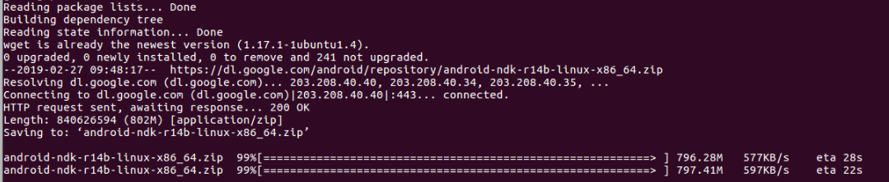

<center>图2-2 build-ndk-toolchain脚本执行过程 ndk下载中</center>

下面简单介绍这个脚本的执行过程：

1. 代码[1-13], 首先下载ndk之后解压到路径/opt/NDK/android-ndk-r14b，版本为r14b. 然后配置ndk的路径为/opt/NDK/android-ndk-r14b。ndk本身也是提供了很多交叉编译器，如下图2-1所示，这是解压ndk之后所对应的toolchains目录。（不推荐使用，最好使用ndk提供的脚本生成特定的交叉编译器）。

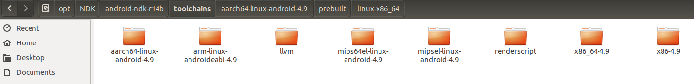

<center>图2-1 ndk自带的交叉编译器</center>

2. 代码[21-23], 使用ndk自带的脚本make_standalone_toolchain.py生成特定的交叉编译环境。这里主要介绍执行这个脚本几个参数。

　　--arch arm：用于指定cpu体系结构。比如arm，x86。 然后在编译的时候，通过指定参数生成具体版本的库文件。比如armv7-a，armv8-a等等，arch参数可以参考图2-3。如果我们想生成x86架构的交叉编译器，修改参数--arch x86即可。

　　--api 16： 用于指定ndk api的版本,这里版本时16.

　　--stl=gnustl，用于指定stl的版本，这里使用时gnu的stl.

　　--install-dir， 将交叉编译环境安装在$ANDROID_HOME/toolchain目录， 也即是：/opt/NDK/android-ndk-r14b/toolchain。

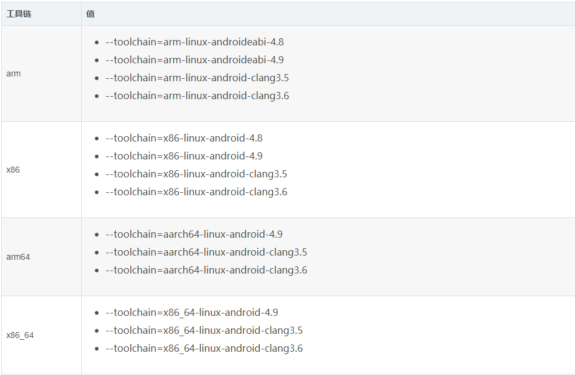

<center>图2-3 arm参数列表</center>

最终生成arm架构的交叉编译位于toolchain目录，如下图2-4所示， 而toolchains是自带的编译器（不推荐使用）。

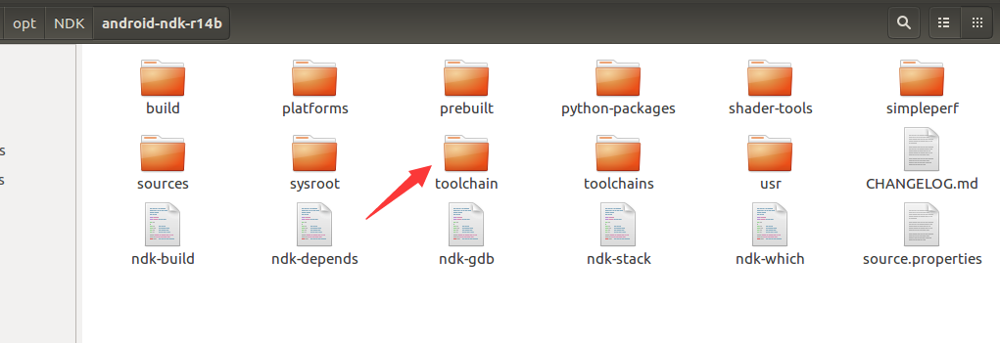

<center>图2-4 新生成的交叉编译位于toolchain目录</center>

注意：

（1）需要使用bin/bash脚本编译器。  使用/bin/sh可能会试别不了[[ $ANDROID_HOME == "" ]]中[[: not found，
（2）需要使用root用户执行这个脚本，不能使用sudo ./build-ndk-toolchain.sh。 （会报错找不到$ANDROID_HOME变量）。

（3）./configure的参数也要参考这个库提供的参数， 比如使用交叉编译需要指定参数--host。默认会生成静态库和动态库。除非我们指定参数阻止，例如--disable-static阻止静态库产生。 一些库则是需要自己手动打开enable-static。 具体还是要参考./configure --help。

（4）编译出错，记得看这个库相关的readme文件。然后发现在执行./confiugre之前需要跑一次./.bootstrap脚本， 然后就顺利编译成功。


# 3、使用arm架构交叉编译器生成armv7-a版本的nettle库

使用如下脚本build-ndk-toolchain.sh下载[nettle](https://ftp.gnu.org/gnu/nettle/nettle-3.4.tar.gz)库，并且将其编译为armv7-a版本。

```bash
#!/bin/bash

if [[ $ANDROID_HOME == "" ]];then
echo "ANDROID_HOME not defined"
exit 0
fi

apt install pkg-config
##LIBRARIES_DOWNLOAD_URL##
NETTLE=https://ftp.gnu.org/gnu/nettle/nettle-3.4.tar.gz

#DOWNLOADER="wget -c"

DOWNLOADER="wget -c"
TOOLCHAIN=$ANDROID_HOME/toolchain
PATH=$TOOLCHAIN/bin:$PATH
HOST=arm-linux-androideabi
PREFIX=$ANDROID_HOME/usr/local
LOCAL_DIR=$ANDROID_HOME/usr/local
TOOL_BIN_DIR=$ANDROID_HOME/toolchain/bin
PATH=${TOOL_BIN_DIR}:$PATH
CFLAGS="-march=armv7-a -mtune=cortex-a9"
DEST=$ANDROID_HOME/usr/local
CC=$HOST-gcc
CXX=$HOST-g++
LDFLAGS="-L$DEST/lib"
CPPFLAGS="-I$DEST/include"
CXXFLAGS=$CFLAGS


cd /tmp
 # nettle library build
  $DOWNLOADER $NETTLE
  tar zxvf nettle-3.4.tar.gz
  cd nettle-3.4/
  PKG_CONFIG_PATH=$PREFIX/lib/pkgconfig/ LD_LIBRARY_PATH=$PREFIX/lib/ CC=$HOST-gcc STRIP=$HOST-strip RANLIB=$HOST-ranlib CXX=$HOST-g++ AR=$HOST-ar LD=$HOST-ld ./configure --host=$HOST --prefix=$PREFIX
  make
  make install
```

脚本注意点：

　　（1）HOST=arm-linux-androideabi， 此时使用的是自己生成的交叉编译器环境

　　（2）CFLAGS="-march=armv7-a -mtune=cortex-a9"，-march用于指定架构版本，而-mtune用于指定更加具体的指令集。

　　（3）gcc的mtune和march选项分析如下介绍

　　　　<http://www.voidcn.com/article/p-tgxklytx-rt.html>

　　　　<http://www.voidcn.com/article/p-cjsywdng-xs.html>

1. 执行这个脚本build-ndk-toolchain.sh，如下图3-1所示，正在下载nettle库。

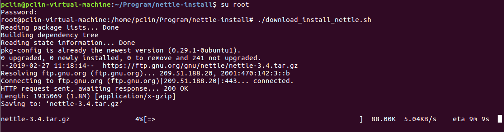

<center>图3-1 执行脚本正在下载nettle库</center>

2. 运行./configure过程如下图3-2所示

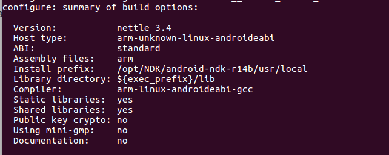

<center>图3-2 执行./configure之后编译的配置信息</center>

3. nettle库编译成功如下图3-3所示。

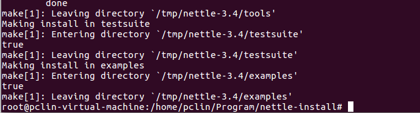

<center>图3-3 nettle交叉编译成功标志</center>

4. 最终生成的arm版本的nettle库如下图3-4所示，包含了静态库和动态库。

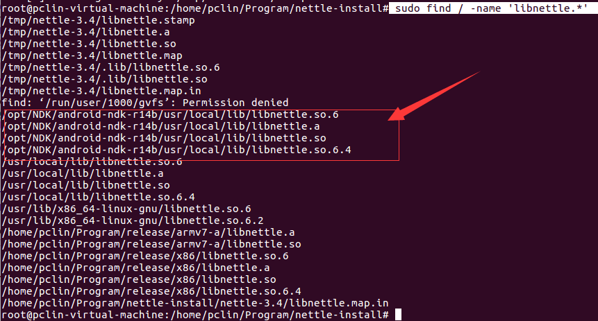

<center>图3-4 生成了arm版本的nettle库</center>

注意：

​	（1）切记不要使用strip命令去裁剪静态库，否则裁剪之后的静态库将无法使用

# 4、使用x86架构交叉编译器生成x86版本的nettle库

说明：删除前面的arm-linux-android交叉环境（避免干扰即将要安装的x86交叉编译环境， 我在这块折腾挺久，觉得没必要在这里花太多时间，因此直接删除前面的环境即可），如下图4-1所示。

（1）删除arm-linux-arndroid交叉编译， 即删除目录/opt/NDK/android-ndk-r14b/toolchain。

（2）删除arm-linux-android编译的nettle，直接将nettle库删除，重新下载。 即删除目录/tmp/nettle-3.4。

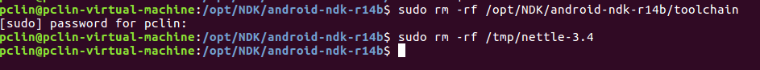

<center>图4-1 删除arm-linux-android交叉环境</center>

1.安装x86交叉编译环境。 由于前面已经安装了NDK，这里直接使用脚本make_standalone_toolchain.py安装x86的交叉环境。（参数--arch x86）如下脚本所示。

```bash
#!/bin/bash


$ANDROID_HOME/build/tools/make_standalone_toolchain.py \
   --arch x86 --api 16 --stl=gnustl \
   --install-dir $ANDROID_HOME/toolchain
```

2.执行上面脚本之后生成的x86交叉环境位于目录/opt/NDK/android-ndk-r14b/toolchain，如下图4-2所示（注意：还是需要使用root用户执行这个脚本）。

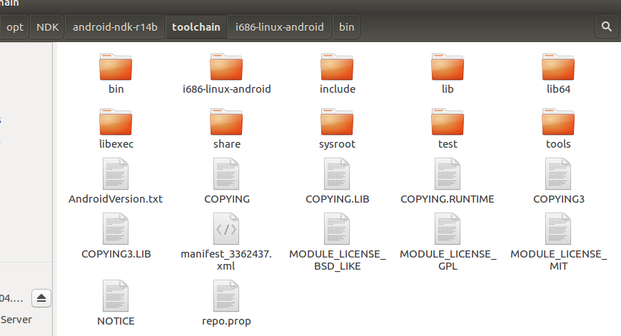

<center>图4-2 生成的x86交叉编译环境目录</center>

3. 使用如下脚本生成x86指令集的nettle库。

```bash
#!/bin/bash

if [[ $ANDROID_HOME == "" ]];then
echo "ANDROID_HOME not defined"
exit 0
fi

apt install pkg-config
##LIBRARIES_DOWNLOAD_URL##
NETTLE=https://ftp.gnu.org/gnu/nettle/nettle-3.4.tar.gz

#DOWNLOADER="wget -c"

DOWNLOADER="wget -c"
TOOLCHAIN=$ANDROID_HOME/toolchain
PATH=$TOOLCHAIN/bin:$PATH
HOST=i686-linux-android
PREFIX=$ANDROID_HOME/usr/local
LOCAL_DIR=$ANDROID_HOME/usr/local
TOOL_BIN_DIR=$ANDROID_HOME/toolchain/bin
PATH=${TOOL_BIN_DIR}:$PATH
CFLAGS="-march=x86 -mtune=native"
DEST=$ANDROID_HOME/usr/local
CC=$HOST-gcc
CXX=$HOST-g++
LDFLAGS="-L$DEST/lib"
CPPFLAGS="-I$DEST/include"
CXXFLAGS=$CFLAGS


cd /tmp
 # nettle library build
  $DOWNLOADER $NETTLE
  tar zxvf nettle-3.4.tar.gz
  cd nettle-3.4/
  PKG_CONFIG_PATH=$PREFIX/lib/pkgconfig/ LD_LIBRARY_PATH=$PREFIX/lib/ CC=$HOST-gcc STRIP=$HOST-strip RANLIB=$HOST-ranlib CXX=$HOST-g++ AR=$HOST-ar LD=$HOST-ld ./configure --host=$HOST --prefix=$PREFIX
  make
  make install
```

注意参数：

（1）HOST=i686-linux-android

（2）CFLAGS="-march=x86 -mtune=native"

4. 执行./configure结果，如下图4-3所示。

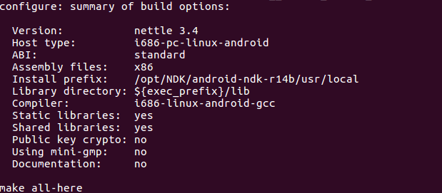

<center>图4-3 执行confiugre之后x86交叉编译的配置信息</center>

5. 使用x86交叉编译生成的nettle库，如下图4-4所示。

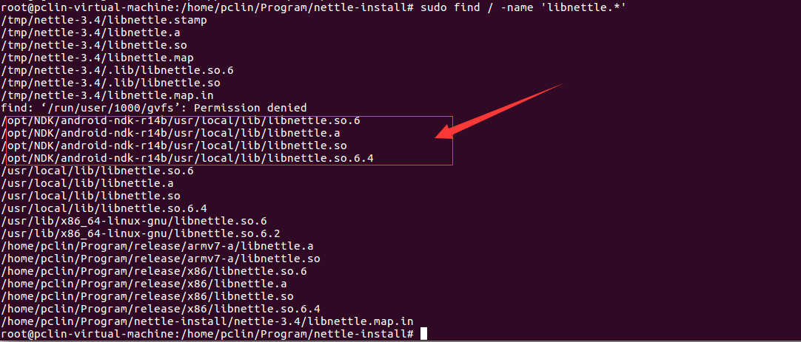

<center>图4-4 x86交叉编译生成的nettle库</center>

# 5、 总结

　　整体上交叉编译这个库nettle比较顺畅。 之前也在linux上交叉编译过其他第三方库提供给windows平台使用，积累了一定经验，对编译出现的问题，一般都可以自己解决。

　　交叉编译arm版本的nettle库之后，继续在本系统上使用交叉编译x86编译这个库，会有些问题，当然这些也可以处理，但是觉得这些不值得花太多时间，因此我直接清除之前的环境。

　　另外，我在linux使用交叉编译x86编译openssl库。需要将arm="i686"，不然会报错。

# 6、参考

1. [编译android版本的aria2所需要android环境以及依赖库](https://github.com/Saint-Theana/aria2-android-build)

2. [Android平台交叉编译流程](https://blog.csdn.net/zhou12314/article/details/74275838)

   