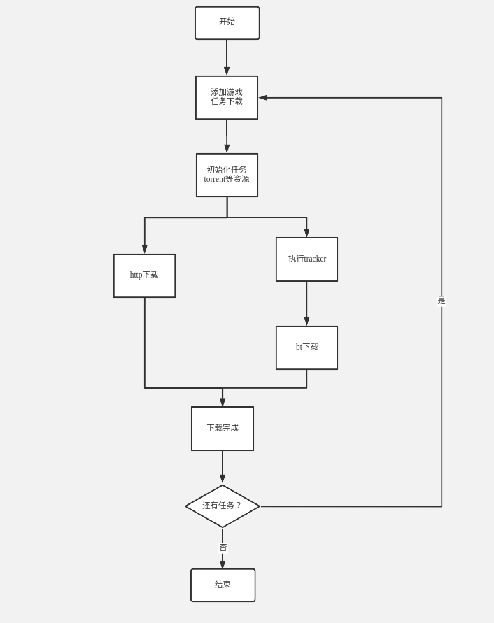
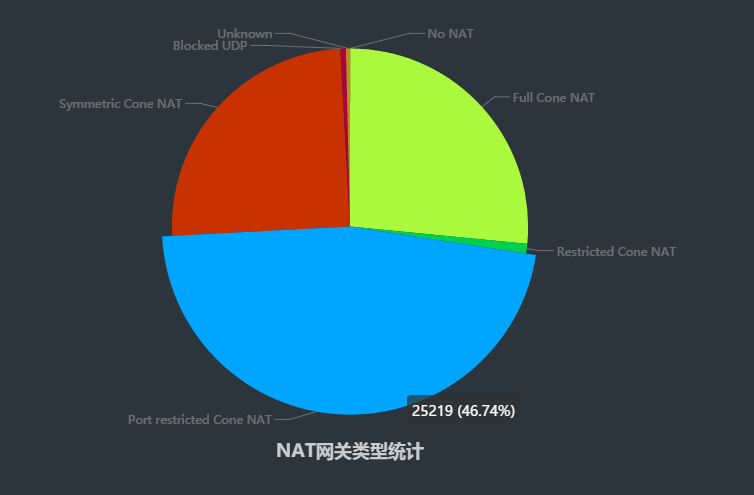

# 前言

我们的游戏盒平台，几乎聚集了国内所有的移动端手机游戏，用户可以在该平台上方便的下载游戏。为了加快用户的下载速度， 我们会部署很多cdn节点， 而cdn节点流量费用是非常昂贵的。 我们思考能否通过节约流量，从而节省费用开销，因此尝试做p2p共享下载，此项目应运而生。

# 1. p2p下载简述

传统下载，一般是由服务器把文件传送到客户端，例如使用FTP,HTTP等等。 我们使用HTTP协议，客户端从服务器或者cdn节点(如果有部署cdn节点的话)获取数据。

基于p2p下载， 主要是使用bt协议(bittorrent)，即种子下载。但我们实际上是**p2sp**(s指的是服务器)下载模式。即http和bt两个渠道同时下载。换句话说, 下载主要还是基于http下载（保证全程有速度)， bt下载作为辅助下载（节约流量），毕竟bt需要有一定用户同时在线，才能发挥作用。而bt下载是从其他用户获取数据，而不用从cdn获取，从而节约了cdn流量。 项目的核心即是bt下载，因为bt下载为了节约流量。

http和bt如何分工同时下载同一个资源呢？  一个资源可以划分成同等大小的许多片。比如1.5G的王者荣耀游戏， 按照一片1M大小，可以划分为1500片。那么http和bt就可以分别下载这1500片的数据， 每个片下载完成将其写入到同一个文件即可（使用不同的文件描述符，每个片写入的位置都不同， 因此文件也不会错乱），两种渠道同事不断获取未下载的片，将其下载写入到文件，直到整个文件的片都下载完成为止。

项目是跨平台的，但是主要应用在android移动端，也可以部署在linux/windows上， 放在这两个平台可以做种预热。

# 2.下载流程图

# 3. http下载

基于libuv的事件机制，一个线程负责http head请求以及资源的处理， 另外两个线程负责实际上数据的下载。

具体参考：[p2p中http大致实现](https://note.youdao.com/ynoteshare1/index.html?id=78b15799968f9414b9d428b2f363fca7&type=note)

# 4. bt下载

**bt(bittorrent)**是一种互联网的p2p传输协议, 用户之间的通信，不需要服务器参与。而且，用户越多传输越快。

**bittorent**下载流程大致如下：

* 首先解析torrent种子文件获取tracker地址等信息
* 获取其他peer,   主要通过连接tracker服务器，获取其他下载者地址(每一个下载者都视为一个peer)
* 连接对方peer， 双方分别告知对方，自己已经拥有的块piece, 然后交换彼此的piece

百度百科：[bt下载](https://baike.baidu.com/item/BT%E4%B8%8B%E8%BD%BD)

维基百科：[BitTorrent (协议)](https://zh.wikipedia.org/zh-hans/BitTorrent_(%E5%8D%8F%E8%AE%AE))

## 4.1 torrent种子文件

torrent文件是一个文本文件，记录了资源对应的信息， 比如资源大小，tracker服务器等等。

参考：[Bt种子基本知识](https://note.youdao.com/ynoteshare1/index.html?id=6549969121d3af417535335668c806bf&type=note)

## 4.2 获取peer方法

在bt（bittorrent）软件中，寻找节点信息（peer）是一项非常重要的工作，只有寻找到足够多peer，才能更好发挥出p2p网络优势，从而提高bt下载速度。获取节点信息主要通过**DHT(Distributed Hash Table）, Tracker服务器, lpd（Local Peer Discovery）**方式。

* **DHT(Distributed Hash Table)**： 称为分布式哈希表，这种方式比较复杂。这部分没有深入了解。

>在不需要服务器的情况下，每个客户端负责一个小范围的[路由](https://zh.wikipedia.org/wiki/路由)，并负责存储一小部分数据，从而实现整个DHT网络的寻址和存储

* **Tracker服务器**： 通过torrent文件中tracker url连接tracker服务器， 登记自己peer信息，并且获取其他peer信息

* **lpd(Local Peer Discovery)**： 基于udp多播的本地发现协议。具体参考另外一篇文章：[浅谈bt中的lpd协议以及源码实现](https://andycong.top/2019/01/14/%E6%B5%85%E8%B0%88bt%E4%B8%AD%E7%9A%84lpd%E5%8D%8F%E8%AE%AE%E4%BB%A5%E5%8F%8A%E6%BA%90%E7%A0%81%E5%AE%9E%E7%8E%B0/#more)

  

## 4.3 p2p穿透

由于IPV4受限，很多用户共享同一个NAT设备，不同NAT设备之下的用户是无法直接通信， 因此需要某种技术使之可以通信， 即是**p2p穿透**

p2p穿透可以说是p2p技术的核心，而p2p又是bt协议的核心。因此p2p穿透在整个项目是一个非常核心的技术。

参考《P2P技术详解》系列文章(**强烈推荐**)： [《P2P技术详解》系列文章](http://www.52im.net/thread-50-1-1.html)

P2P原理以及如何实现（自己整理）：[P2P原理以及如何实现](https://blog.csdn.net/qq_33850438/article/details/79700133)

p2p穿透概率(即用户和用户连接成功概率), 也受到各种网络类型的影响， 据我们在移动端调查，结果如下

# 5.项目成果

项目大致可以节约10%的数据流量，从而每年为公司节省 10%的流量费用。

另外，p2p混合下载与传统http对比，速度稍微慢了一些，影响不大。

也说明事情往往有两面性。

# 6.项目限制和优化

尽管项目尽力做到最好， 但是也有一些不足以及限制， 大致如下几点。

## 限制

1. 只有用户在wifi环境下，才会启动p2p下载，不然走传统的http服务器下载。（主要是考虑到不窃取用户的数量）

2. 用户只有在下载的过程中分享，用户下载完成，删除对应的资源文件(android上资源安装包apk)，停止分享。考虑到下载完成驻留apk文件，影响用户，导致做种分享的时间非常短暂。(**这是非常致命的点**) ，或者后续可以选择下载完成，驻留一小部分数据继续分享给其他用户， 增加数据分享。

3. 受限的用户的上传带宽， 普通用户的带宽的上行速度大约是下行速度的1/8. 也就是用户下载速度1M/s, 分享上传速度125K/s。换言之，也就是说用户下载速度，受到其他用户上传速度限制。

4. 我们目前只对非对称(none sysmmetric cone nat))的网络类型进行穿透，而对称类型 (sysmmetric cone nat) 这部分目前穿透比较困难，我们暂时没有实现， 后续可以继续优化。（由上图统计可知，对称网络类型大约占了1/4）。

## 优化

1. **提高peer穿透效率：**每个节点，从tracker获取到到的peer列表， 可以直接向整个peer列表各发送一个空的udp消息，这样的目的是让我们的NAT对整个peer列表信任(假如此我们节点位于NAT之后)，后续如果有此peer列表中的peer发送消息到此节点, 大概率情况下，此节点将会直接收到这个消息(如果此节点对这个peer的信任还在保活期)， 那么此节点和该peer将穿透将成功。
2. **peer节点优先级：**客户端目前从tracker获取到的peer列表，每个peer只有IP, Port字段信息，导致客户端无法对peer的优先级进行排序。 因此，每个peer可以考虑附带其他信息， 比如peer的带宽，peer的地理位置信息(方便客户端优先选择物理距离近的节点)， peer下载资源完成的进度等等。 这样客户端便可以通过对节点优先级的排序，优先连接优质的节点，从而提高下载/分享的效率。

# 7.项目小结

此项目也是几经波折，陆陆续续做了将近两年。

最开始借鉴开源库aria2，直接在此基础上修改，由于aria2的bt协议是基于tcp的， 而tcp得穿透成功率不如udp，因此在aria2基础上就引入了libutp库(一个基于udp协议可靠库)， 参考了transmission中使用libutp。

由于aria2是单线程，后面为了充分利用多核性能，在aria2框架基础上，将其扩展为多线程。 

由于受到了aria2框架限制，修改后多线程版本的aria2不稳定， 经常出bug。因此后面决定重构项目，对整个项目架构重新设计，不管http还是bt底层通讯协议都使用libuv(基于reactor模式)，复用aria2一些基础类，http的实现参考传统游戏盒的实现，bt下载参考aria2的逻辑，这也花了挺长时间。

目前还说，已经很稳定了。

# 8.学习笔记

做项目的过程中， 也学习了相关的开源库， 并且记录了一些相关笔记。

* [aria2-笔记整理汇总](http://note.youdao.com/s/dUYwf0rA)
* [transmission-笔记整理汇总](http://note.youdao.com/s/dMTmkOwc)
* [libuv-笔记整理汇总](http://note.youdao.com/s/ZEKoOXak)

# 9. 参考

1. [p2p中http大致实现](https://note.youdao.com/ynoteshare1/index.html?id=78b15799968f9414b9d428b2f363fca7&type=note)
2. [浅谈bt中的lpd协议以及源码实现]([https://andycong.top/2019/01/14/%E6%B5%85%E8%B0%88bt%E4%B8%AD%E7%9A%84lpd%E5%8D%8F%E8%AE%AE%E4%BB%A5%E5%8F%8A%E6%BA%90%E7%A0%81%E5%AE%9E%E7%8E%B0/#more](https://andycong.top/2019/01/14/浅谈bt中的lpd协议以及源码实现/#more))
3. [《P2P技术详解》系列文章](http://www.52im.net/thread-50-1-1.html)
4. [P2P原理以及如何实现](https://blog.csdn.net/qq_33850438/article/details/79700133)
5. [aria2-笔记整理汇总](http://note.youdao.com/s/dUYwf0rA)
6. [transmission-笔记整理汇总](http://note.youdao.com/s/dMTmkOwc)
7. [libuv-笔记整理汇总](http://note.youdao.com/s/ZEKoOXak)

