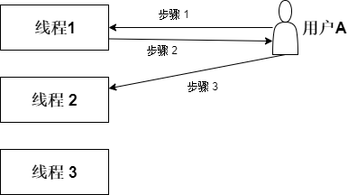
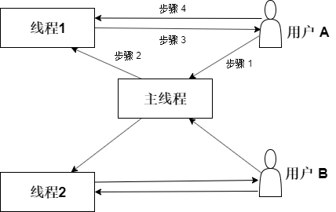
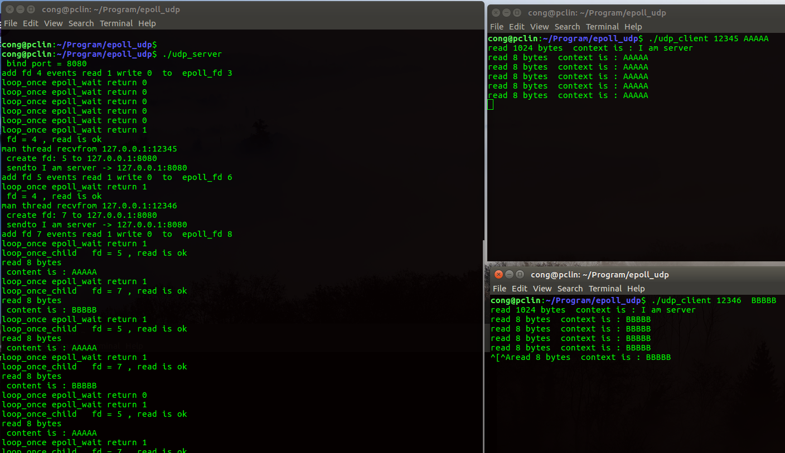
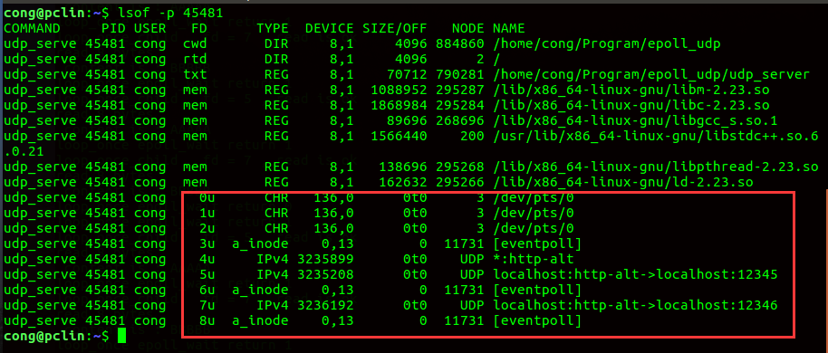

# 前言

> 在基于udp的多线程模型中，希望一个线程对应一个连接/用户，或者一个线程对应一个用户。然而udp是无状态连接的，因此想要实现此想法，就没有想象这么顺利。 最终参考了腾讯手Q游戏中心后台开发人员黄日成的想法，才解决了此问题。


# 1、场景需求

我们程序希望使用udp协议监听，当有新的用户连接到来，程序可以使用一个线程与此连接通信。后续这个用户的信息都投递到这个线程当中。基本要求主要两点：

* 使用udp协议
* 一个线程对应一个连接（用户）


# 2、预先方案

**（1） 每个线程都监听同一个端口（udp使用SO_REUSEPORT属性,可以实现, linux 3.9以上内核），每个线程单独处理一个用户任务， 这样每个线程分工就非常明确。**

为了充分利用多核CPU资源，进行UDP的多处理，我们可以预先创建多个线程，每个线程都创建监听相同udp socket(IP、端口相同，分别使用SO_REUSEADDR、SO_REUSEPORT属性），这样利用内核的UDP socket查找算法来达到UDP的多进程负载均衡。 

一切看上去好像挺不错的，然而，这样的方案会起这样问题：

由于线程中的监听的描述符是无状态的（udp），当有新用户udp连接进来的时候， 内核会根据负载均衡，唤醒其中一个线程监听的描述符。比如当用户A连接过来，内核随机唤醒线程1监听的描述符处理该连接。 当用户A第二次连接过来的时候，内核可能会唤醒线程2监听的描述符处理该连接，如下图所示。 那这样就做不到一个线程/描述符， 对应一个用户。 这样处理数据会非常麻烦。（每个线程监听相同端口，接收的数据会互相干扰）



当然，我们也可以将线程收到其他用户的消息投递到准确的线程中去。 比如当线程2收到用户A的消息，那么线程2将此消息内容传递到线程1中，这种投递有两种方式，如下。

* 将线程2接收消息，然后将此消息传递到线程1中。（这个过程增加了一次数据的拷贝）
* 将线程2监听的描述符投递到线程1，并且告诉线程1，有用户A的消息到达，让线程1使用线程2监听的描述符去接收用户A的消息。那么这种情况会造成其他线程可能使用自己的描述符fd接收消息，此时各个线程描述符接收消息时需要上锁。 这虽然避免了数据的拷贝，但是各个线程的描述符接收消息却需要上锁，这无疑也增大了开销。

因此，这种方案理论上可以实现，但是会有许多额外不必要的开销。

**（2）每个线程监听不同端口， 这样各个线程的数据就不会干扰， 每个线程就可以很好单独处理一个用户任务。**

基于上面的问题，主要是每个线程监听同一个端口造成数据干扰，很自然我们会想，那么让每个线程监听不同端口， 这样各个线程的数据就不会干扰， 每个线程就可以很好单独处理一个用户任务。

然而现实没有这么完美，这样程序需要为每个用户单独分配一个监听端口。而且还要提前告诉每个客户端，这样客户端才能连接过来，这个有点不切实际了。


# 3、最终方案

**基于多线程的udp协议accept模型**

因此，我们多么希望有一个方案，类似tcp协议accetp模型，按需分配tcp socket。 主线程监听，当有新的连接到达，主线程通过accept获得对应的fd，然后将此fd投递到空闲的线程中去，那么后续与这个用户的通信都可以在这个线程独立完成。

然而，几经波折之后发现，在udp协议中，也有类似的accept模型，可以达到tcp协议的accetp模型效果。（参考了腾讯手Q游戏中心后台开发人员黄日成的想法）

主线程使用描述符listen_fd监听指定udp端口，当有新的用户连接到达的时，主线程通过recvfrom接收消息，得到对方的ip和port，此时主线程再主动创建一个udp new_fd,也是与主线程绑定相同ip和port,  **使用connect连接对方（udp中的connect作用与对方确定一个四元组的关系）,这样此连接后续的消息都会投递此new_fd中，而不会投递到主线程listen_fd中，并且new_fd除了接收此用户的消息之外，不会接收其他新用户消息，即此new_fd已经与此用户建立一一对应关系。**最终，再将此new_fd投递到空闲的线程中去, 这样也可以实现与这个用户的通信都在该线程独立完成。如下图



主线程监听udp指定端口，当新用户A连接到达时候，主线程创建对应的fd主动连接用户A（使用connect）, 然后在将此fd投递到线程1中，那么后续与用户A的通信都在线程1独立完成。用户A的消息也会准确投递都线程1中。

上述方案，可能会有疑惑？

* **如何确保用户A的消息会发送到线程1的fd，而不会投递到主线程fd呢？**

理论上，用户A的消息到达的时候，主线程fd和线程1 fd都可能会被唤醒去接收此消息(因为两者监听相同IP和port)，但是，线程A的fd已经明确跟用户A绑定了四元组关系，内核会优先将消息投递到已经有明确关系的连接中，因此会优先投递到线程1 fd中。假如在线程1关闭此fd，那么此时用户A的消息将会投递到主线程fd中。

* **当已经存在多个fd（监听相同ip和port）的情况下, 新来的链接如何确保投递到主线程中呢？**

如上图中，当程序除了主线程监听之外，还维护线程1 与用户A的连接情况下，理论上，由于主线程和线程1的fd都监听相同的ip和port, 那么当新的用户B连接情况下，用户B的连接可能投递这两者其中一个。 但是由于线程1 fd已经与用户A通过connect绑定一起，不再接收其他消息，因此不会接收到新用户B连接。所以新的用户B连接只会投递到主线程的fd当中，其他子线程的fd已经与特定用户绑定在一起了。


# 4、方案验证

实现步骤参考如下：（参考黄日成文章提出想法）

1. UDP svr创建UDP socket fd,设置socket为REUSEADDR和REUSEPORT、同时bind本地地址local_addr 

   ```cpp
   listen_fd = socket(PF_INET, SOCK_DGRAM, 0)
   setsockopt(listen_fd, SOL_SOCKET, SO_REUSEADDR, &opt,sizeof(opt))
   setsockopt(listen_fd, SOL_SOCKET, SO_REUSEPORT, &opt, sizeof(opt))
   bind(listen_fd, (struct sockaddr * ) &local_addr, sizeof(struct sockaddr))
   ```

2. 创建epoll fd，并将listen_fd放到epoll中 并监听其可读事件

    ```cpp
   epoll_fd = epoll_create(1000);
   ep_event.events = EPOLLIN|EPOLLET;
   ep_event.data.fd = listen_fd;
   epoll_ctl(epoll_fd , EPOLL_CTL_ADD, listen_fd, &ep_event)
   in_fds = epoll_wait(epoll_fd, in_events, 1000, -1);
   ```

3. epoll_wait返回时，如果epoll_wait返回的事件fd是listen_fd，调用recvfrom接收client第一个UDP包并根据recvfrom返回的client地址, 创建一个新的socket(new_fd)与之对应，设置new_fd为REUSEADDR和REUSEPORT、同时bind本地地址local_addr，然后connect上recvfrom返回的client地址

   ```cpp
   recvfrom(listen_fd, buf, sizeof(buf), 0, (struct sockaddr )&client_addr, &client_len)
   new_fd = socket(PF_INET, SOCK_DGRAM, 0)
   setsockopt(new_fd , SOL_SOCKET, SO_REUSEADDR, &reuse,sizeof(reuse))
   setsockopt(new_fd , SOL_SOCKET, SO_REUSEPORT, &reuse, sizeof(reuse))
   bind(new_fd , (struct sockaddr ) &local_addr, sizeof(struct sockaddr));
   connect(new_fd , (struct sockaddr * ) &client_addr, sizeof(struct sockaddr)
   ```

4. 将新创建的new_fd加入到epoll中并监听其可读等事件

   ```cpp
   client_ev.events = EPOLLIN;
   client_ev.data.fd = new_fd ;
   epoll_ctl(epoll_fd, EPOLL_CTL_ADD, new_fd , &client_ev)
   ```

5. 当epoll_wait返回时，如果epoll_wait返回的事件fd是new_fd 那么就可以调用recvfrom来接收特定client的UDP包了

   ```cpp
   recvfrom(new_fd , recvbuf, sizeof(recvbuf), 0, (struct sockaddr * )&client_addr, &client_len)
   ```

**服务端程序demo** ，与上面稍微基本相同，不同是每个子线程单独使用一个epoll。

```cpp
/*
 * 编译：g++ -std=c++11 udp_server.cc -o udp_server -lpthread
 * 运行： ./udp_server
 *
 */
#include <arpa/inet.h>
#include <errno.h>
#include <fcntl.h>
#include <netinet/in.h>
#include <signal.h>
#include <stdio.h>
#include <stdlib.h>
#include <string.h>
#include <sys/epoll.h>
#include <sys/socket.h>
#include <unistd.h>
#include <map>
#include <string>
#include<thread>
#include<vector>

using namespace std;


//默认最多创建5个线程,一个线程对应一个连接
std::vector<std::thread> vthreads;
const int max_threads = 5;


void handlerNewConnect(struct sockaddr_in client_addr);


bool output_log = true;
unsigned short port = 8080;

#define exit_if(r, ...)                                                                          \
    if (r) {                                                                                     \
        printf(__VA_ARGS__);                                                                     \
        printf("%s:%d error no: %d error msg %s\n", __FILE__, __LINE__, errno, strerror(errno)); \
        exit(1);                                                                                 \
    }

void setNonBlock(int fd) {
    int flags = fcntl(fd, F_GETFL, 0);
    exit_if(flags < 0, "fcntl failed");
    int r = fcntl(fd, F_SETFL, flags | O_NONBLOCK);
    exit_if(r < 0, "fcntl failed");
}
void setFdpro(int fd, int property){
	int sockopt = 1;
	if (setsockopt(fd, SOL_SOCKET, property, (void* )&sockopt, sizeof(sockopt)) < 0) {
		exit_if(true, "fd = %d failed  setFdPro", fd);
	 }
}

void updateEvents(int efd, int fd, int events, int op) {
    struct epoll_event ev;
    memset(&ev, 0, sizeof(ev));
    ev.events = events;
    ev.data.fd = fd;
    printf("%s fd %d events read %d write %d  to  epoll_fd %d\n", op == EPOLL_CTL_MOD ? "mod" : "add", fd, ev.events & EPOLLIN, ev.events & EPOLLOUT,efd);
    int r = epoll_ctl(efd, op, fd, &ev);
    exit_if(r, "epoll_ctl failed");
}

//将新用户的地址投递到空闲的线程中。让空闲的线程主动去连接
void handleAccept(int efd, int fd) {
	struct sockaddr_in client_addr;
    socklen_t rsz = sizeof(client_addr);
    size_t size = 1024;
    char recvbuf[size];
    int recv_sive = recvfrom(fd,recvbuf,sizeof(recvbuf),0,(struct sockaddr * )&client_addr, &rsz);
    exit_if(recv_sive<0,"recvfrom error, %s:%d,  error: %s",inet_ntoa(client_addr.sin_addr),ntohs(client_addr.sin_port),strerror(errno));
    if(output_log){
    	printf("man thread recvfrom %s:%d\n",inet_ntoa(client_addr.sin_addr),ntohs(client_addr.sin_port));
    }
    if(vthreads.size() < max_threads){
		//创建新的线程处理
		std::thread t(handlerNewConnect,client_addr);
		vthreads.push_back(std::move(t));
    }else{
    	//当线程数超过限制   直接忽略该消息。
    	printf("because of reaching the limit number of thread , rejust from %s:%d",inet_ntoa(client_addr.sin_addr),ntohs(client_addr.sin_port));
    }
}

void handleRead(int efd, int fd) {
	//将收到的内容回传回去
	struct sockaddr_in raddr;
	socklen_t rsz = sizeof(raddr);
	size_t size = 1024;
	char recvbuf[size];
	int recv_sive = recvfrom(fd,recvbuf,sizeof(recvbuf),0,(struct sockaddr * )&raddr, &rsz);
	exit_if(recv_sive < 0, "recvfrom error from %s:%d, reason: %s", inet_ntoa(raddr.sin_addr),ntohs(raddr.sin_port),strerror(errno));
	if(output_log){
		printf("read %d bytes\n", recv_sive);
		printf(" content is : %s\n", recvbuf);
	}
	int r = 0;
	while(recv_sive > 0){
		r = sendto(fd,recvbuf+r,recv_sive,0,(struct sockaddr * )&raddr,rsz);
		exit_if(r<0, "sendto error to  %s:%d, reason: %s", inet_ntoa(raddr.sin_addr),ntohs(raddr.sin_port),strerror(errno));
		recv_sive -= r;
	}
}

void handleWrite(int efd, int fd) {
	//处理写事件，  暂时留着
}

void loop_once_main(int efd, int lfd, int waitms) {
    const int kMaxEvents = 20;
    struct epoll_event activeEvs[100];
    int n = epoll_wait(efd, activeEvs, kMaxEvents, waitms);
    if (output_log)
        printf("loop_once epoll_wait return %d\n", n);
    for (int i = 0; i < n; i++) {
        int fd = activeEvs[i].data.fd;
        int events = activeEvs[i].events;
        if (events & (EPOLLIN | EPOLLERR)) {
        	printf(" fd = %d , read is ok\n", fd);
            if (fd == lfd) {
                handleAccept(efd, fd);
            } else {
            	printf("fd is not listen_fd");
                handleRead(efd, fd);
            }
        } else if (events & EPOLLOUT) {
            if (output_log)
                printf("handling epollout\n");
            handleWrite(efd, fd);
        } else {
            exit_if(1, "unknown event");
        }
    }
}
void loop_once_child(int efd, int lfd, int waitms) {
    const int kMaxEvents = 20;
    struct epoll_event activeEvs[100];
    int n = epoll_wait(efd, activeEvs, kMaxEvents, waitms);
    if (output_log)
        printf("loop_once epoll_wait return %d\n", n);
    for (int i = 0; i < n; i++) {
        int fd = activeEvs[i].data.fd;
        int events = activeEvs[i].events;
        if (events & (EPOLLIN | EPOLLERR)) {
        	printf("loop_once_child   fd = %d , read is ok\n", fd);
            handleRead(efd, fd);
        } else if (events & EPOLLOUT) {
            if (output_log)
                printf("handling epollout\n");
            handleWrite(efd, fd);
        } else {
            exit_if(1, "unknown event");
        }
    }
}


void handlerNewConnect(struct sockaddr_in client_addr){
	//创建一个新的fd,connect对方。raddr
	int client_fd = socket(AF_INET, SOCK_DGRAM, 0);
	setFdpro(client_fd,SO_REUSEADDR);
	setFdpro(client_fd,SO_REUSEPORT);
	struct sockaddr_in local_addr;
	memset(&local_addr, 0, sizeof local_addr);
	local_addr.sin_family = AF_INET;
	local_addr.sin_port = htons(port);
	local_addr.sin_addr.s_addr = INADDR_ANY;

	int r = ::bind(client_fd, (struct sockaddr *) &local_addr, sizeof(struct sockaddr));
	exit_if(r, "bind to 0.0.0.0:%d failed %d %s", port, errno, strerror(errno));
	r = connect(client_fd , (struct sockaddr * )&client_addr, sizeof(struct sockaddr));
	exit_if(r, "connect %s,%d failed: %d,%s", inet_ntoa(client_addr.sin_addr),port, errno, strerror(errno));

	printf(" create fd: %d to %s:%d\n",client_fd, inet_ntoa(client_addr.sin_addr),port);
	//连接成功之后，发送消息
	char send_buf[1024]="I am server";
	r = sendto(client_fd,send_buf,sizeof(send_buf),0,(struct sockaddr * )&client_addr,sizeof(client_addr));
	//r=send(client_fd,send_buf,sizeof(send_buf),0);

	exit_if(r <0, "sendto %s,%d failed: %d,%s", inet_ntoa(client_addr.sin_addr),port, errno, strerror(errno));
	printf(" sendto %s -> %s:%d \n",send_buf,inet_ntoa(client_addr.sin_addr),port);


	//为该用户单独创建epoll
	int epollfd = epoll_create(1);
	exit_if(epollfd < 0, "epoll_create failed");

	//将新的描述符号设置非阻塞
	setNonBlock(client_fd);
	//将新的客户端fd加入到epoll中监听读事件
	updateEvents(epollfd, client_fd, EPOLLIN, EPOLL_CTL_ADD);
	for (;;) {  //子线程的轮寻操作
		loop_once_child(epollfd, client_fd, 10000);
	}
}

int main(int argc, const char *argv[]) {
    if (argc > 1) {
        output_log = false;
    }
    int epollfd = epoll_create(1);
    exit_if(epollfd < 0, "epoll_create failed");
    //udp
    int listenfd = socket(AF_INET, SOCK_DGRAM, 0);
    exit_if(listenfd < 0, "socket failed");
    struct sockaddr_in addr;
    memset(&addr, 0, sizeof addr);
    addr.sin_family = AF_INET;
    addr.sin_port = htons(port);
    addr.sin_addr.s_addr = INADDR_ANY;
    int r = ::bind(listenfd, (struct sockaddr *)&addr, sizeof(struct sockaddr));
    exit_if(r, "bind to 0.0.0.0:%d failed %d %s", port, errno, strerror(errno));
    printf(" bind port = %d \n", port);

    setFdpro(listenfd,SO_REUSEADDR);
    setFdpro(listenfd,SO_REUSEPORT);
    setNonBlock(listenfd);
    updateEvents(epollfd, listenfd, EPOLLIN , EPOLL_CTL_ADD);
    for (;;) {
        loop_once_main(epollfd, listenfd, 10000);
    }
    //退出回收线程资源
    for(auto it = vthreads.begin(); it != vthreads.end(); ++it){
    	it->join();
    }
    return 0;
}

```

客户端demo

```cpp
/*
 * 编译：  g++ udp_client.cc  -o udp_client
 * 运行： ./udp_client port  字符串
 *
 */
#include <arpa/inet.h>
#include <errno.h>
#include <fcntl.h>
#include <netinet/in.h>
#include <signal.h>
#include <stdio.h>
#include <stdlib.h>
#include <string.h>
#include <sys/epoll.h>
#include <sys/socket.h>
#include <unistd.h>
#include <map>
#include <string>
using namespace std;

#define exit_if(r, ...)                                                                    		\
    if (r) {                                                                                     \
        printf(__VA_ARGS__);                                                                     \
        printf("%s:%d error no: %d error msg %s\n", __FILE__, __LINE__, errno, strerror(errno)); \
        exit(1);                                                                                 \
}
std::string serverIp = "127.0.0.1";
int serverPort = 8080;

int main(int argc, const char *argv[]) {
	if(argc < 3){
		printf("usage:  ./udp_client client_port  sendSomething");
		return 0;
	}
	unsigned short local_port = atoi(argv[1]);
    //udp
    int fd = socket(AF_INET, SOCK_DGRAM, 0);
    exit_if(fd < 0, "socket failed");
    struct sockaddr_in local_addr;
    memset(&local_addr, 0, sizeof local_addr);
    local_addr.sin_family = AF_INET;
    local_addr.sin_port = htons(local_port);
    local_addr.sin_addr.s_addr = INADDR_ANY;
    int r = ::bind(fd, (struct sockaddr *) &local_addr, sizeof(struct sockaddr));
    exit_if(r, "bind to 0.0.0.0:%d failed %d %s", local_port, errno, strerror(errno));

    struct sockaddr_in other_addr;
	memset(&other_addr, 0, sizeof other_addr);
	other_addr.sin_family = AF_INET;
	other_addr.sin_port = htons(serverPort);
	other_addr.sin_addr.s_addr = inet_addr(serverIp.c_str());

	int i = 2;
    while(1){
    	int r = sendto(fd,argv[2],sizeof(argv[2]),0,(struct sockaddr * )&other_addr,sizeof(other_addr));
    	exit_if(r<0, "sendto error");

    	struct sockaddr_in other;
    	socklen_t rsz = sizeof(other);
    	char recv_buf[1024];
    	int recv_sive = recvfrom(fd,recv_buf,sizeof(recv_buf),0,(struct sockaddr * )&other,&rsz);
    	exit_if(recv_sive<0, "recvfrom error");
    	printf("read %d bytes  context is : %s\n", recv_sive, recv_buf);
    	sleep(5);
    }
    close(fd);
    return 0;
}

```

运行结果分析：

* 主线程监听fd是4，所对应epoll 描述符 3， 一开始用户A,B消息都准备投递到fd4
* 主线程收到创建线程与用户A的描述符是5，对应epoll是6， 可见用户A后续消息都准确投递到fd5
* 线程与用户B描述符7，，对应epoll是6, 可见用户B后续消息都准确投递到fd7



查看描述符对应的关系如下：

* 描述符fd 4 监听所有。
* 描述符fd 5已经绑定了localhost:12345(用户A)
* 描述符fd 7已经绑定了localhost:12346(用户B)



**可知，通过验证，确定此方案可行**。

# 5、小结

我们小组讨论了好几次，都卡在这个技术点上，没有比较好的方案。后续我在查找资料过程中，找到了上述的解决方案，得益于腾讯手Q游戏中心后台开发人员黄日成，在此表示感谢。

# 6、参考

* [告知你不为人知的 UDP：连接性和负载均衡](https://cloud.tencent.com/developer/article/1004555)

* [epoll(7) - Linux manual page](http://man7.org/linux/man-pages/man7/epoll.7.html)

  

  