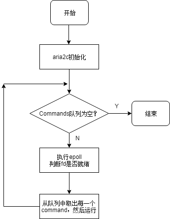

# 前言

> aria2大部分代码都看过（主要是http/https，bittorrent模块），也在这个框架上修改了部分逻辑，包括tracker逻辑，引入了utp协议等等，总的来说，对aria2框架还是比较熟悉。因此本文，主要是以个人的理解，谈谈aria2c框架。

# 一、aria2简单介绍

* aria2是一个轻量级、支持多协议、命令行下载工具, 支持多种下载协议（有http/https,ftp,sftp, Bittorrent ,Metalink）下载工具。 aria2c可以通过rpc进行交互（支持json,xml格式），以下来自官方文档解释

>aria2 is a **lightweight** multi-protocol & multi-source command-line **download utility**. It supports **HTTP/HTTPS**, **FTP**, **SFTP**, **BitTorrent** and **Metalink**. aria2 can be manipulated via built-in **JSON-RPC** and **XML-RPC** interfaces.

**官方文档参考**[https://aria2.github.io/](https://aria2.github.io/)

* aria2c使用简单, 可从官方文档下**Usage Examples**中，了解aria2c的使用。
* 支持可视化的前端web UI :[**webui-aria2**](https://github.com/ziahamza/webui-aria2)。
* aria2文档很全面，配置选项也非常丰富，可参考：[https://aria2.github.io/manual/en/html/index.html](https://aria2.github.io/manual/en/html/index.html)
* 小中型项目，代码也是挺多（统计release 1.35.0版本，代码包括.cc和.h一共有952多个， 代码总行数14万，包括注释）
* aria2c历史，第一个release版本（0.1.0）在2006年发布。至今已经经历了几十个版本。
* github上的开源项目地址：目前stars数量有20K.
* aria2c主要开发是由一个日本程序员完成。
* aria2的定位是一个轻量级的下载工具，导致aria2只是一个单线程的程序。

# 二、aria2框架

aria2的框架非常类似于单核CPU在系统中处理任务。我们知道操作系统维护了一个任务队列，CPU轮询从这个任务队列中取出任务执行，当任务结束或者任务时间片到达的时候，CPU会保存当前任务，然后去执行下一个任务，一直不断轮询执行。任务可以有优先级，任务也可以产生新的任务，然后将新产生任务添加到任务队列等待下次运行。

对于aria2来说，aria2是不断从command集合(类似CPU中的任务)队列中取出command,然后再执行command。command也有优先级，一个command也可以产生新的command。

aria2框架大致如下图所示：

​	                                                          

command基本分为两类，一类是常规command(routineCommands), 每次都会执行。另一类是任务command(commands)，只有当条件满足或者超时才会执行。

常规command(routineCommands_)，比如：

* AutoSaveCommand， 表示定时自动保存过程文件，有利于断点续传
* SaveSessionCommand，定时记录当前下载任务情况。

任务command(commands_)， 比如：

* http下载，分为几个阶段，每个阶段代表一个command，CreateRequestCommand，HttpInitiateConnectionCommand，HttpRequestCommand，HttpResponseCommand，HttpDownloadCommand等。

* bt下载，也分为几个阶段：PeerInitiateConnectionCommand，InitiatorMSEHandshakeCommand，PeerInteractionCommand

  

# 三、框架优缺点（trade-off）

**优点：**

* 支持rpc远程增添任务，修改配置选项等等。

* 轻量级，充分利用单核cpu性能。

* 日志级别清晰

* 基本所有实现都自己写，很多STL模板，包括http协议完全自己实现。

* 使用了C++11特性 （这个对于学习C++11的人，学习源码不个不错选择）

**缺点：**

* 单线程
* 所有描述符都是同步操作（ 性能低）
* 代码耦合度太高

# 四、参考

[官方文档](https://aria2.github.io/)

​	

