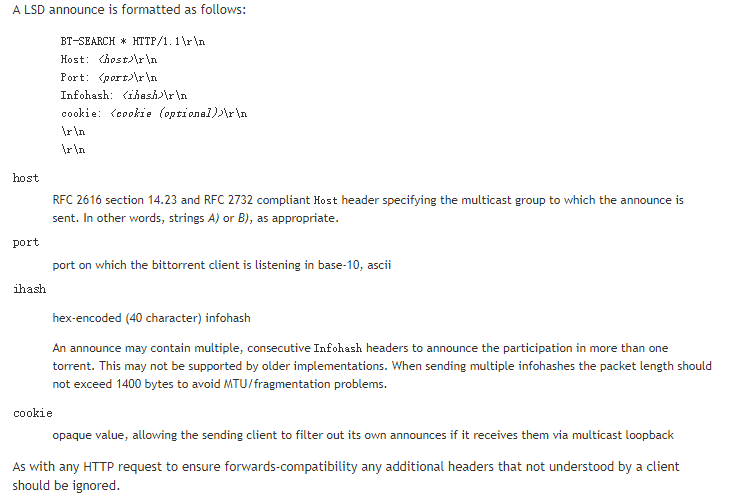
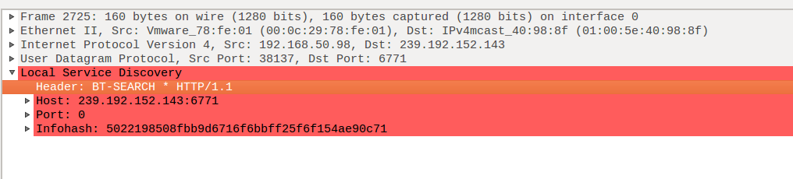

# 前言

　　在bt（bittorrent）软件中，寻找节点信息（peer）是一项非常重要的工作，只有寻找到足够多peer，才能更好发挥出p2p网络优势，从而提高bt下载速度。获取节点信息主要通过DHT（(Distributed Hash Table）、Tracker服务器、lpd（Local Peer Discovery）方式 ，本章节主要讨论lpd协议以及其协议在aria2c中的源码实现。

# 1、lpd协议

　　lpd协议是基于udp多播（http over udp-multicast，格式有点像http报文的udp多播）的应用程协议，提供了一种类似ssdp（Simple Service Discovery Protocol）的机制，在本地网络中向一个特定群体宣布它的存在，也从这个群体中获取其他成员的节点信息。

# 2、lpd协议消息格式

　　使用的多播地址和端口号为239.192.152.143:6771，其协议消息格式如下图2-1所示（发送和接收都是这个数据格式）。



<center>图2-1 lpd协议消息格式</center>

**Host**:表示主机多播地址和端口号。
**Port**:表示bt端口。
**Infohash**:表示种子的hash值，代表一种资源的标志。

　　另外，使用wireshark抓lpd协议的数据包，数据有些奇怪，下图2-2是使用wireshark抓取发送lpd消息的数据包，其中的port表示bt端口为0，这个是不正确，我还特意调试，每次发现程序都有发送正确的bt端口号，至于为什么抓到的包总是显示0，暂时也没有搞清楚。




<center>图2-2 使用wireshark抓取发送lpd消息的数据包</center>

# 3、lpd协议的特点

**发送消息**: 每隔5分钟向特定群体（多播群体）发送一个消息，以表明它的存在。 为了避免发送大量消息（多播风暴，multicast storms），应该每分钟发送不超过一个消息，这种是针对发送消息失败的情况。

**接收消息**: 收到lpd消息，我们将此消息的源地址作为新的peer的IP地址，与此消息的bt端口，一起组合成一个新的peer节点。

note: 自己发往多播地址的消息，自己也可以收到。

# 4、lpd协议编程实现大致流程

## （1）lpd发送消息

1. 创建套接字，并且设置其多播ttl，loop等。

2. 创建发送消息内容。（对于lpd，其消息内容字段基本不变）。 

3. 定时向多播地址发送此消息。

## （2）lpd接收消息

1. 创建套接字，bind绑定到多播地址中（意味着这个套接字只接收发往这个多播地址的消息，也就是发往这个多播地址消息，这个套接字是可以接收）。

2. 将自己加入多播中，成为其中一员，这样才可以接收多播消息（多播消息，即这个多播群体中某一成员发往这个多播地址的消息）。 

3. 将接收到的多播消息的源地址作为新的peer节点的IP地址，与此消息的bt端口一起组成新的peer节点。

4. 将这个peer保存起来，bt尝试连接这个节点。

# 5、在aria2c中分析lpd协议的源码实现

## （1）lpd接收消息

1、首先主要判断是否有启动lpd参数,如果开启接着创建一个LpdMessageReceiver对象，用于lpd接收消息。创建LpdReceiveMessageCommand命令，用于监听lpd的消息。

```c++
//是否启动lpd, 另外如果torrent是私有的,那么其peer不起作用.
if (option->getAsBool(PREF_BT_ENABLE_LPD) && btReg->getTcpPort() &&
    (metadataGetMode || !torrentAttrs->privateTorrent))
{
    if (!btReg->getLpdMessageReceiver())
    {
        A2_LOG_INFO("Initializing LpdMessageReceiver.");
        //创建一个LpdMessageReceiver,指定特定的multicast IP,端口
        auto receiver = std::make_shared<LpdMessageReceiver>(LPD_MULTICAST_ADDR,  LPD_MULTICAST_PORT);
        bool initialized = false;
        //获取指定的lpd接口,默认不指定.
        const std::string& lpdInterface =  e->getOption()->get(PREF_BT_LPD_INTERFACE);
        if (lpdInterface.empty()) {
            //初始化lpd接收消息
            if (receiver->init("")) {
                initialized = true;
            }
        }
        else {
            auto ifAddrs = SocketCore::getInterfaceAddress(lpdInterface, AF_INET,  AI_NUMERICHOST);
            for (const auto& soaddr : ifAddrs) {
                char host[NI_MAXHOST];
                if (inetNtop(AF_INET, &soaddr.su.in.sin_addr, host, sizeof(host)) ==
                    0 &&
                    receiver->init(host)) {
                    initialized = true;
                    break;
                }
            }
        }
        if (initialized) {
            //创建并且初始化LpdMessageReceiver成功,将这个对象保存到btReg中.
            btReg->setLpdMessageReceiver(receiver);
            A2_LOG_INFO(fmt("LpdMessageReceiver initialized. multicastAddr=%s:%u,"
                            " localAddr=%s",
                            LPD_MULTICAST_ADDR, LPD_MULTICAST_PORT,
                            receiver->getLocalAddress().c_str()));
            //创建一个LpdReceiveMessageCommand
            e->addCommand(make_unique<LpdReceiveMessageCommand>(e->newCUID(), receiver, e));
        }
        else {
            A2_LOG_INFO("LpdMessageReceiver not initialized.");
        }
    }
    //如果接收对象创建成功了. 接着创建lpd发送对象.
    if (btReg->getLpdMessageReceiver()) {
        const unsigned char* infoHash =  bittorrent::getInfoHash(requestGroup->getDownloadContext());
        A2_LOG_INFO("Initializing LpdMessageDispatcher.");
        auto dispatcher = std::make_shared<LpdMessageDispatcher>(
            std::string(&infoHash[0], &infoHash[INFO_HASH_LENGTH]),
            btReg->getTcpPort(), LPD_MULTICAST_ADDR, LPD_MULTICAST_PORT);
        if (dispatcher->init(btReg->getLpdMessageReceiver()->getLocalAddress(),
                             /*ttl*/ 1, /*loop*/ 1)) {
            A2_LOG_INFO("LpdMessageDispatcher initialized.");
            auto cmd =
                make_unique<LpdDispatchMessageCommand>(e->newCUID(), dispatcher, e);
            cmd->setBtRuntime(btRuntime);
            e->addCommand(std::move(cmd));
        }
        else {
            A2_LOG_INFO("LpdMessageDispatcher not initialized.");
        }
    }
}
```

2、首先创建一个LpdMessageReceiver对象，注意此时用的地址是多播地址和端口。多播地址：描述一组接收者。

```c++
constexpr const char LPD_MULTICAST_ADDR[] = "239.192.152.143";
constexpr uint16_t LPD_MULTICAST_PORT = 6771;
```

```c++
LpdMessageReceiver::LpdMessageReceiver(const std::string& multicastAddress,
                                       uint16_t multicastPort)
    : multicastAddress_(multicastAddress), multicastPort_(multicastPort)
{
}
```

3、lpd接收器的初始化。主要是绑定多播地址（为了只接受发往这个多播目的地址的信息）。 为了可以接收到多播消息，还应该将自己加入到多播地址中。

```c++
bool LpdMessageReceiver::init(const std::string& localAddr)
{
  try {
    socket_ = std::make_shared<SocketCore>(SOCK_DGRAM);
#ifdef __MINGW32__
    // Binding multicast address fails under Windows.
    socket_->bindWithFamily(multicastPort_, AF_INET);
#else  // !__MINGW32__
    //绑定了IP和port, 表明这个套接字只接受(发往这个IP和端口的)地址.    (可能多播机制起到这个转发作用,会将各个消息转发出去)
    socket_->bind(multicastAddress_.c_str(), multicastPort_, AF_INET);
#endif // !__MINGW32__
    A2_LOG_DEBUG(fmt("Joining multicast group. %s:%u, localAddr=%s",
                     multicastAddress_.c_str(), multicastPort_,
                     localAddr.c_str()));
    //将本地加入组播中(这样才有可有收到组播其他成员发送多来的消息.)
    socket_->joinMulticastGroup(multicastAddress_, multicastPort_, localAddr);
    socket_->setNonBlockingMode();
    localAddress_ = localAddr;
    A2_LOG_INFO(fmt("Listening multicast group (%s:%u) packet",
                    multicastAddress_.c_str(), multicastPort_));
    return true;
  }
  catch (RecoverableException& e) {
    A2_LOG_ERROR_EX("Failed to initialize LPD message receiver.", e);
  }
  return false;
}
```

4、初始化成功之后，那么创建一个LpdReceiveMessageCommand用于监听lpd的消息。首先将对应的套接字注册到poll事件池中。

```c++
LpdReceiveMessageCommand::LpdReceiveMessageCommand(
    cuid_t cuid, const std::shared_ptr<LpdMessageReceiver>& receiver,
    DownloadEngine* e)
    : Command(cuid), receiver_(receiver), e_(e)
{
	//将套接字添加到poll,准备读取数据.
  e_->addSocketForReadCheck(receiver_->getSocket(), this);
}
```

5、LpdReceiveMessageCommand中接收消息，然后保存peer。这个command主要是接收消息，消息内容保存了peer和hash值。然后将peer保存到hash对应的资源中。 注意，每次最多接收20个peer的消息。

（note: 这个peer的端口是发送者额外提供的bt端口。不是发送者发送此消息的端口）

```c++
//主要是将收到其他peer信息,将这个peer信息保存到对应资源的peerStroage中
bool LpdReceiveMessageCommand::execute()
{
  if (e_->getRequestGroupMan()->downloadFinished() || e_->isHaltRequested()) {
    return true;
  }
  for (size_t i = 0; i < 20; ++i) {
	  //收到LpdMessage消息,保存了其peer和hash值信息.
    auto m = receiver_->receiveMessage();
    if (!m) {
      break;
    }
    auto& reg = e_->getBtRegistry();
    //获取哈希对应种子的下载上下文对象..
    auto& dctx = reg->getDownloadContext(m->infoHash);
    if (!dctx) {
      A2_LOG_DEBUG(fmt("Download Context is null for infohash=%s.",
                       util::toHex(m->infoHash).c_str()));
      continue;
    }
    //如果这个种子是私有的,忽略的peer.
    if (bittorrent::getTorrentAttrs(dctx)->privateTorrent) {
      A2_LOG_DEBUG("Ignore LPD message because the torrent is private.");
      continue;
    }
    RequestGroup* group = dctx->getOwnerRequestGroup();
    assert(group);
    auto btobj = reg->get(group->getGID());
    assert(btobj);
    auto& peerStorage = btobj->peerStorage;
    assert(peerStorage);
    auto& peer = m->peer;
    //增加此peer.
    if (peerStorage->addPeer(peer)) {
      A2_LOG_DEBUG(fmt("LPD peer %s:%u local=%d added.",
                       peer->getIPAddress().c_str(), peer->getPort(),
                       peer->isLocalPeer() ? 1 : 0));
    }
    else {
      A2_LOG_DEBUG(fmt("LPD peer %s:%u local=%d not added.",
                       peer->getIPAddress().c_str(), peer->getPort(),
                       peer->isLocalPeer() ? 1 : 0));
    }
  }
  e_->addCommand(std::unique_ptr<Command>(this));
  return false;
}
```

## （2）lpd发送消息

1、当lpd接收消息对象创建完成之后，那么创建lpd消息发送对象LpdMessageDispatcher。注意此时使用tcpPort端口作为这个peer的bt端口。

```c++
//如果接收对象创建成功了. 接着创建lpd发送对象.
if (btReg->getLpdMessageReceiver()) {
    const unsigned char* infoHash =  bittorrent::getInfoHash(requestGroup->getDownloadContext());
    A2_LOG_INFO("Initializing LpdMessageDispatcher.");
    auto dispatcher = std::make_shared<LpdMessageDispatcher>(
        std::string(&infoHash[0], &infoHash[INFO_HASH_LENGTH]),
        btReg->getTcpPort(), LPD_MULTICAST_ADDR, LPD_MULTICAST_PORT);
    if (dispatcher->init(btReg->getLpdMessageReceiver()->getLocalAddress(),
                         /*ttl*/ 1, /*loop*/ 1)) {
        A2_LOG_INFO("LpdMessageDispatcher initialized.");
        auto cmd =
            make_unique<LpdDispatchMessageCommand>(e->newCUID(), dispatcher, e);
        cmd->setBtRuntime(btRuntime);
        e->addCommand(std::move(cmd));
    }
    else {
        A2_LOG_INFO("LpdMessageDispatcher not initialized.");
    }
}
```

LpdMessageDispatcher对象的构建以及lpd消息的创建。

```c++
LpdMessageDispatcher::LpdMessageDispatcher(const std::string& infoHash,
                                           uint16_t port,
                                           const std::string& multicastAddress,
                                           uint16_t multicastPort,
                                           std::chrono::seconds interval)
    : infoHash_(infoHash),
      port_(port),
      multicastAddress_(multicastAddress),
      multicastPort_(multicastPort),
      timer_(Timer::zero()),
      interval_(std::move(interval)),
	  //格式化lpd请求.
      request_(bittorrent::createLpdRequest(multicastAddress_, multicastPort_, infoHash_, port_))
{
}
```

```c++
std::string createLpdRequest(const std::string& multicastAddress,
                             uint16_t multicastPort,
                             const std::string& infoHash, uint16_t port)
{
  return fmt("BT-SEARCH * HTTP/1.1\r\n"
             "Host: %s:%u\r\n"
             "Port: %u\r\n"
             "Infohash: %s\r\n"
             "\r\n\r\n",
             multicastAddress.c_str(), multicastPort, port,
             util::toHex(infoHash).c_str());
}
```

2、初始化发送lpd对象。其主要是创建套接字socket,然后设置对应套接字的ttl, loop等等。

```c++
bool LpdMessageDispatcher::init(const std::string& localAddr, unsigned char ttl,
                                unsigned char loop)
{
  try {
    socket_ = std::make_shared<SocketCore>(SOCK_DGRAM);
    socket_->create(AF_INET);
    A2_LOG_DEBUG(
        fmt("Setting multicast outgoing interface=%s", localAddr.c_str()));
    socket_->setMulticastInterface(localAddr);
    A2_LOG_DEBUG(
        fmt("Setting multicast ttl=%u", static_cast<unsigned int>(ttl)));
    socket_->setMulticastTtl(ttl);
    A2_LOG_DEBUG(
        fmt("Setting multicast loop=%u", static_cast<unsigned int>(loop)));
    socket_->setMulticastLoop(loop);
    return true;
  }
  catch (RecoverableException& e) {
    A2_LOG_ERROR_EX("Failed to initialize LpdMessageDispatcher.", e);
  }
  return false;
}
```

3、创建LpdDispatchMessageCommand用于发送消息。LpdDispatchMessageCommand中控制消息的lpd发送机制（防止频繁发送导致网络瘫痪）。

1）每隔5分钟发送一次消息，发送成功则5s后再发送。

2）如果发送失败，连续发送5此失败，那么也要等到5s再发送。

```c++
bool LpdDispatchMessageCommand::execute()
{
  if (btRuntime_->isHalt()) {
    return true;
  }
  //每间隔5分钟执行发送一次.
  if (dispatcher_->isAnnounceReady()) {
    try {
      A2_LOG_INFO(fmt("Dispatching LPD message for infohash=%s",
                      util::toHex(dispatcher_->getInfoHash()).c_str()));
      if (dispatcher_->sendMessage()) {
        A2_LOG_INFO("Sending LPD message is complete.");
        dispatcher_->resetAnnounceTimer();
        tryCount_ = 0;
      }
      else {
    	  //每5分钟只能连续发送5次失败.. 5分钟过后才能继续发送请求.(除非有发送请求成功)
        ++tryCount_;
        if (tryCount_ >= 5) {
          A2_LOG_INFO(
              fmt("Sending LPD message %u times but all failed.", tryCount_));
          dispatcher_->resetAnnounceTimer();
          tryCount_ = 0;
        }
        else {
          A2_LOG_INFO("Could not send LPD message, retry shortly.");
        }
      }
    }
    catch (RecoverableException& e) {
      A2_LOG_INFO_EX("Failed to send LPD message.", e);
      dispatcher_->resetAnnounceTimer();
      tryCount_ = 0;
    }
  }
  e_->addCommand(std::unique_ptr<Command>(this));
  return false;
}
```

4、发送消息。实质上使用了LpdMessageDispatcher对象发送消息，其目标地址是多播地址。

```c++
bool LpdMessageDispatcher::sendMessage()
{
  return socket_->writeData(request_.c_str(), request_.size(),
                            multicastAddress_,
                            multicastPort_) == (ssize_t)request_.size();
}

```

# 6、总结

　　lpd（Local Peer Discovery）是基于udp多播协议的应用层协议，主要应用与bt软件中寻找本地peer节点，从ariac的源码实现可以看出，lpd协议相对比较简单。另外，如果在bt软件中实现这一功能，那么就需要维护不断发送和接收消息的连接，这个也是需要成本的， 毕竟天下没有免费的午餐。


# 7、参考

1. [lpd协议官方文档](http://www.bittorrent.org/beps/bep_0014.html)

2. [aria2开源项目](https://github.com/aria2/aria2)

3. [udp单播、多播、广播](http://www.cnblogs.com/jingliming/p/4477264.html)

4. [有道云笔记](https://note.youdao.com/web/#/file/WEBf94cc9072070e8cca29c9e584c16540a/note/WEBfc86fd305047d09e18536a9022b56bd0/)


