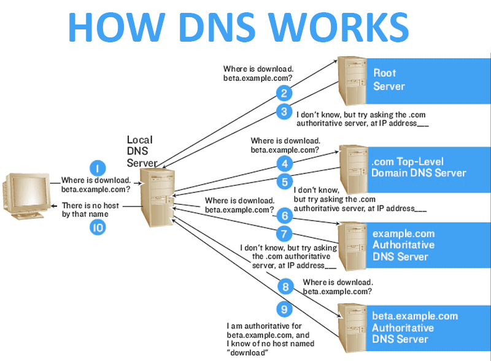
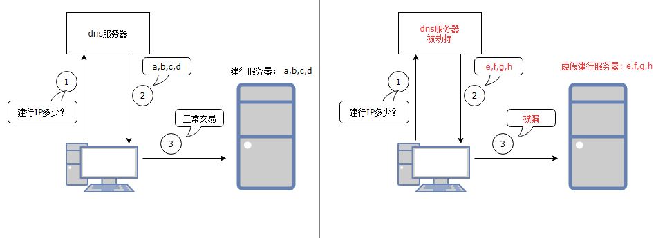
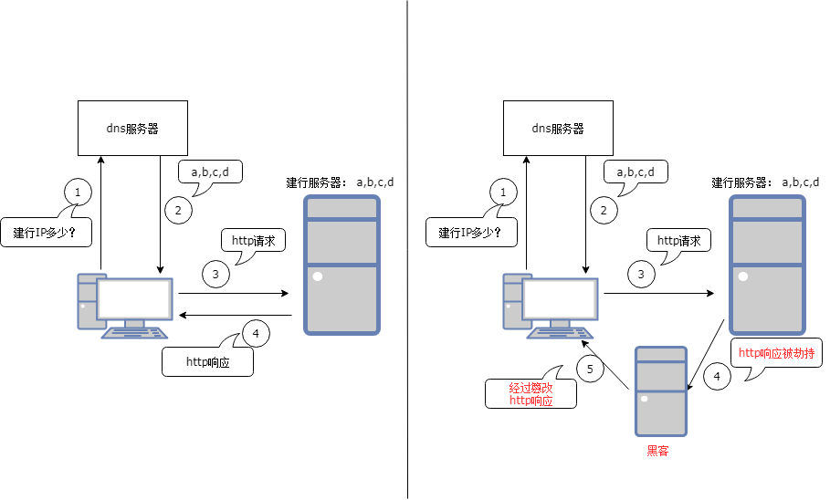
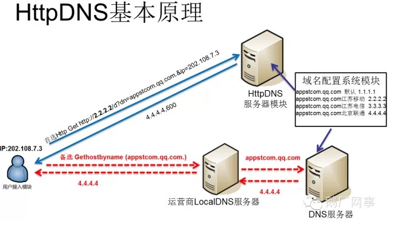

# 前言

> 最近在移动端中，处理有关于http/https请求中dns被劫持问题。 本文打算对其中涉及的技术做简要梳理， 包括dns域名解析原理， dns劫持以及应对方案（目前使用httpdns解决方案）。

  

# 一、dns解析

## （1）什么是dns

**DNS(Domain Name System   域名解析系统)**，将给定的域名解析为具体的IP地址。 在互联网上每个机器都是使用IP地址进行通信的， 由于IP地址是一串数字，不方便记忆，因此人们希望使用一串便以记忆的字符串代替IP， 这串字符就是IP对应的名字，简称域名。而使用域名访问的时候，需要借助dns（域名解析系统），将域名解析为具体的IP， 我们就可以跟这个IP通信。举例， 当我们访问谷歌时，在网页是以**google.com**域名搜索, 其实我们是跟**93.46.8.90**通信（比如dns将google.com解析为93.46.8.90）, 显然记住google.com比93.46.8.90方便。

## （2）dns工作原理

dns工作流程如上图所示，演示了访问一个uri经过dns解析全过程。（当中忽略了dns应用缓存，本地host文件）。当中只要找到对应域名记录，则返回结果并停止往下访问。

（1）第一步，应该判断一下dns应用缓存是否有域名**download.beta.example.com**的IP，如果有直接返回。（对于浏览器来说可以开启禁用缓存， 那么将直接跳过这一步）

（2）第二步，获取本地hosts文件，判断是否有域名**download.beta.example.com**的记录，如果有直接返回。（windows hosts文件默认保存在:C:\Windows\System32\Drivers\etc\hosts,  在linux上hosts文件位于/etc/hosts)。

（3）第三步，将域名发送到本地dns服务器，如果本地dns缓存有域名**download.beta.example.com**的记录，直接返回。对应上图步骤1.

（4）第四步，将域名**download.beta.example.com**发送到根服务器(**Root Server**)，**Root Server**维护顶级域名服务器（eg, .com, .cn, .org等 全球13个), 识别到该顶级域名为**com**, 将**com**域名服务器地址IP返回，并告诉请求者，他不知道域名地址，但是**com**域名服务器知道，你可以去找它。对应步骤2, 3

（5）第五步，将域名**download.beta.example.com**发送到**com**域名服务器，**com**域名服务器它不知道该域名地址，但是它知道**example.com**域名服务器地址，于是返回将**example.com**地址返回并告诉请求者，你可以去哪里找它。对应步骤4,5

（6）第六步，将域名**download.beta.example.com**发送到**example.com**域名服务器, **example.com**服务器它不知道该域名地址，但是它知道**beta.example.com**域名服务器地址，于是返回将**beta.example.com**地址返回并告诉请求者，你可以去哪里找它。对应步骤 6,7

（7）第七步，将域名**download.beta.example.com**发送到**beta.example.com**域名服务器,  **beta.example.com**服务器如果知道该域名地址，将返回**download.beta.example.com**地址并且将结果缓存到本地dns中, 如果不知道， 那么将中止继续递归访问。对应步骤8,9

（8）第八步，将解析结果返回给用户， 整个dns解析结束。对应步骤10.

##    （3）http请求

1. 首先将http请求uri中的host发起域名解析。
2. 将域名解析结果IP地址，在互联网上发起http请求。（eg, get/post）
3. 对应的http服务器将http请求结果返回给用户。

# 二、dns劫持

**dns劫持也称域名劫持**。 即当我们向dns发起域名解析的请求， 结果这个请求被劫持，劫持之后可能不响应我们的请求，更多的是给予我们错误的IP地址，将我们导向其他服务器，从而可以窃取我们的信息，甚至盗用我们的财务。当我们浏览网页时，如果dns被劫持，可能访问到意想不到的网页。如下图所示。

ps：dns劫持其实并不是真的“黑掉”了我们的想访问的目标网站，而是冒名顶替、招摇撞骗罢了。

因此，dns解析被劫持，我们如何判断以及处理。

（1）当我们发起域名解析请求时，在本地hosts文件以及本地缓存没有找到对应的记录，我们就需要向外网发起域名解析请求，如果这时候被劫持，假如劫持之后没有返回解析IP给我们，那我们域名解析的接口会调用失败，这时候我们可以尝试调用几次，如果都失败，我们可以停下来分析，是否域名写错等等（如果有多个域名，程序可以自动切换其他域名解析尝试）

（2）如果劫持之后返回无效的IP， 那么会导致我们无法连接上，最终在程序可以通过连接超时发现问题。（如果有多个域名，程序可以自动切换其他域名解析尝试）

（3）如果劫持之后返回可以连接的IP，当我们成功连接此IP并且发送http请求，对方也响应此请求。那么我们应当如何辨别此响应是来自被劫持之后的服务器，而不是我们自己的服务器呢？ （类似上图，用户访问建设银行服务器，由于被劫持，访问到了假的建设银行服务器，此时我们辨别此服务器真假呢？ ）  比如我们可以让http头部携带多一个字段，用于鉴定此响应是否来自我们目标服务器。 对于每一个http请求的资源， 目标服务器拥有对应资源的唯一标识。并且服务器在响应客户端的请求时候，都会带上这个标识。 由于其他服务器没有我们请求资源的标志字段，因此，我们就可以通过判断http响应请求是否正确包含此字段，从而可以鉴别此服务器的真伪。 （如果有多个域名，程序可以自动切换其他域名解析尝试）

**谁会劫持我们 ？ **

（1）运营商:  运营商主要是为了盈利，对我们访问的网页插入一些广告，让人烦厌的广告。

（2）gwf： 中国防火墙（Great Firewall of China）,主要是劫持我们访问国外的网页。dns服务器解析出口要经过政府管辖的服务器（主要在北京，广州，上海），如果发现是解析国外的dns，那么会返回给我们无效的IP地址，让我们无法访问。

（3）其他第三方（主要是黑客）：大部分也是为了获取一己私利，不过这个会比运营商更狠，经常会窃取我们的信息，包括我们的支付信息从而盗取我们的钱财。

# 三、http劫持

http劫持主要是http内容的劫持，如下图所示， 即纂改了http请求响应的状态码，http头部信息，或者消息内容。

  http请求是在dns域名解析之后，拿到具体的IP，再发起http请求。

（1） 如果此http请求被劫持，劫持之后没有给我们应答，那么我们同样可以通过请求超时发现问题。

（2） 如果此http请求被劫持之后，虚假的服务器响应应答，那么我们也可以通过判断响应是否携带资源请求的唯一标识，来判断服务器的真伪。

（3） 如果http请求得到了目标服务器的真实响应，但是这个响应在返回过程被劫持了，而且被纂改信息， 程序基本就没法判断响应信息是否被修改过了（http头部资源唯一标识没有被修改）, 这样基本无解了。 为了避免这种情况，尽量使用https代替http。 如上图情况所描述。

# 四、httpdns解决方案

传统使用dns服务器解析域名，即将要解析的域名向运营商的dns服务器发起解析的请求（本质发送udp报文）。 httpdns是基于http协议的域名解析服务， 我们使用的是腾讯提供的httpdns服务，即将要解析的域名以http协议发送到腾讯服务器，腾讯再使用权威的dns服务器查询域名，然后将查询结果返回。如下图所示，从而使我们绕过了本地dns解析造成的域名劫持问题。（至于腾讯dns解析为什么不会被劫持，可能腾讯可以绕过运营商dns服务器的解析吧 ， 或者以其他手段避免dns解析被劫持，能够确保将正确解析结果返回给我们），如下图所示。

具体详细信息可以参考腾讯官方提供的文档： [httpdns 腾讯官方文档](https://cloud.tencent.com/document/product/379/3519#httpdns.E5.AE.9E.E7.8E.B0.E7.9A.84.E5.8E.9F.E7.90.86.3F)

# 五、小结

 本章主要在阅读了一些博客有关dns相关文章基础上，再根据自己的理解，加以整理。 其中阅读到关于使用httpdns遇到问题细节，收益良多，此文[《黑客技术？没你想象的那么难！——dns劫持篇》](https://cloud.tencent.com/developer/article/1197474)

另外，文中关于dns劫持的插图，使用draw.io完成的在线作图，感觉这个挺好用。

# 六、参考

（1）[黑客技术？没你想象的那么难！——dns劫持篇](https://cloud.tencent.com/developer/article/1197474)
（2）[深入理解Http请求、DNS劫持与解析](https://juejin.im/post/59ba146c6fb9a00a4636d8b6)
（3）[腾讯httpdns文档](https://cloud.tencent.com/document/product/379/3519#httpdns.E5.AE.9E.E7.8E.B0.E7.9A.84.E5.8E.9F.E7.90.86.3F)

