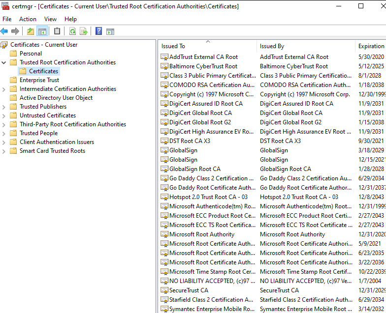
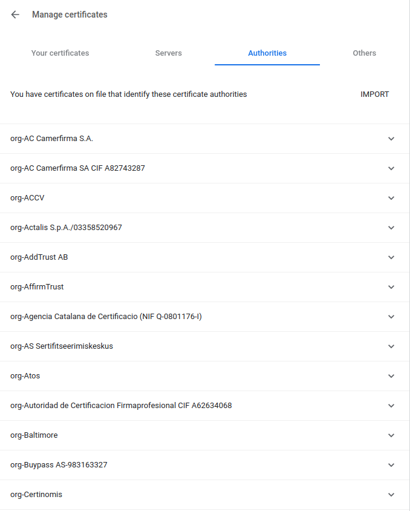
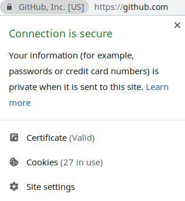
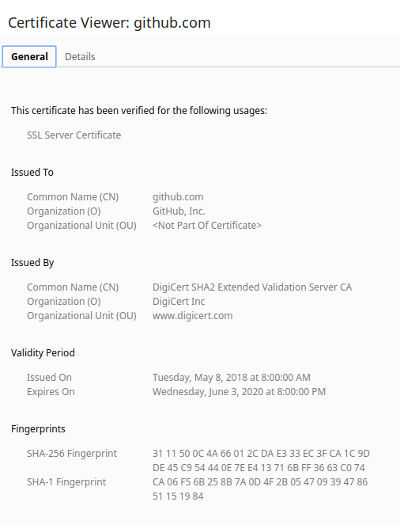
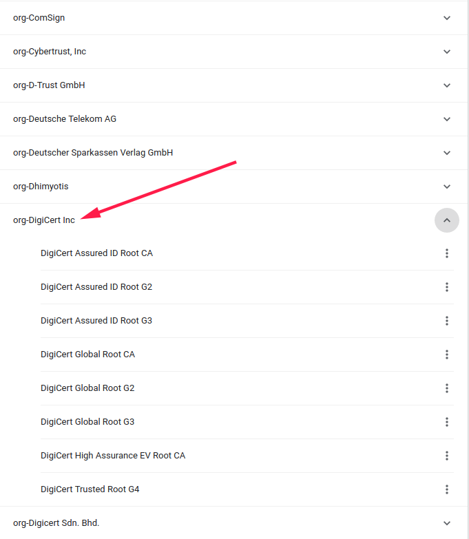

# 前言

最近有接触到关于https这块内容，涉及到证书以及通信解密问题，因此学习记录一下。 本文主要记录数字证书以及数字签名的原理。

# 一、数字证书以及数字签名存在意义

我们将信息传递给其他人，如何让别人相信这是我们所发出的信息。 或者说， 当我们从A接受到某个信息时， 我们怎么知道信息是A发出来的， 这是信任的问题。

以前，我们解决这个问题，会在信息的后面，附上我们的亲笔签名， 比如写信在最后会有自己亲笔签名， 这样别人看到签名，就会相信这封信是我们写的。在互联网上，如何解决这个问题呢？就出现了数字证书以及数字签名。

简单说，数字证书以及数字签名就是帮助通信双方在互联网上建立一种信任的机制吧。


# 二、互联网上信任机制建立

在互联网上，通常需要找**CA（CA, Certificate Authority，证书颁发机构）**认证中心，协助双方建立一种信任机制。CA证书认证的作用主要是帮助别人进行数字签名，CA使用自己的**私钥**帮助其他人的数字证书签名,即也是加密，其他人使用使用CA的**公钥**对证书进行解密（前提大家都拥有CA的公钥，后面补充说明），就可以获得对应可信任的数字证书。因为经过CA签名的数字证书，我们都会信任他。

下面说明A公司的数字证书经过CA签名之后，如何获得用户B的信任。

* 第一步：A将公钥(证书主要的对象，public key)以及A公司名称等其它相关信息，生成一个数字证书（证书内容大致如下），告诉CA，然后CA使用私钥对其进行 “签名”， 即数字签名（也是加密意思，签名之后，只有拥有CA的公钥才可以解开这个数字证书），最终生成一份关于A签了名的数字证书， 并将其颁发给A。

>×××××××××××××××证书内容开始×××××××××××××××××
>
>Issuer : SecureTrust CA
>
>Subject : ABC Company
>
>Valid from ： 某个日期
>
>Valid to： 某个日期
>
>Public Key : 一串很长的数字
>
>…… 其它的一些证书内容……

* 第二步：A拿到CA签名的数字证书之后，使用CA公钥会对证书做校验，因为本身有用CA的公钥。经验校验之后。当A跟B通信前，A会将经过签名的数字证书发送给B。

* 第三步：B接收到A的数字证书之后，会使用CA的公钥对A的数字证书进行解密，如果正确，那么将得到A（公钥）。

* 第四步：A和B后续通信，A将使用自己的私钥加密信息，Ｂ使用A的公钥解密信息。反之亦可，Ｂ使用A的公钥加密信息，Ａ使用自己的私钥解密信息。在https通信过程中，A和B还会约定生成一把对称秘钥，加密后续https通信的所有内容(因为对称密码加密解密时间更快，效率更高)。

详细的过程可以参考阮一峰老师：[<font color="#0000FF">数字签名是什么？</font>](http://www.ruanyifeng.com/blog/2011/08/what_is_a_digital_signature.html)

或者更加通俗的：[<font color="#0000FF">数字证书原理</font>](https://www.cnblogs.com/JeffreySun/archive/2010/06/24/1627247.html)

# 三、CA证书中心

系统会自带许多权威的证书， 这些证书称为“根证书”（这些根证书同样都包含有公钥，没有经过签名，因此我们直接拥有他们的公钥），这些证书机构会给企业签名证书，但凡经过这些权威证书机构签名的数字证书，我们就认为该企业的证书是可信的。（因为一旦企业的证书出了问题，这些权威机构是要付责任的，毕竟权威机构签名认证是付费的，所谓拿人钱财替人消灾），当拿到被这些权威机构签名的数字证书，我们可以使用权威机构的证书（自带的）自带的公钥，来对这个数字证书进行解密，从而获取这个数字证书所包含的信息（公钥）。

总之，根证书主要是验证数字证书的真伪。

**windows自带的根证书**

查看方式dos运行：certmgr.msc



**linux自带的证书**

```bash
cong@pc:~$ ls /usr/share/ca-certificates/mozilla/Di* 
/usr/share/ca-certificates/mozilla/DigiCert_Assured_ID_Root_CA.crt
/usr/share/ca-certificates/mozilla/DigiCert_Assured_ID_Root_G2.crt
/usr/share/ca-certificates/mozilla/DigiCert_Assured_ID_Root_G3.crt
/usr/share/ca-certificates/mozilla/DigiCert_Global_Root_CA.crt
/usr/share/ca-certificates/mozilla/DigiCert_Global_Root_G2.crt
/usr/share/ca-certificates/mozilla/DigiCert_Global_Root_G3.crt
/usr/share/ca-certificates/mozilla/DigiCert_High_Assurance_EV_Root_CA.crt
/usr/share/ca-certificates/mozilla/DigiCert_Trusted_Root_G4.crt
cong@pc:~$ 
```

**chrome自带根证书**



# 四、在浏览器上证书验证流程

比如当我们访问https://github.com/  会先获取对方的数字证书。然后查看证书签名的机构，是否在浏览器能够信任的列表之后。比如org-AC Camerfirma S.A， org-ACCV等机构。

 如果其数字证书是在浏览器所信任的根证书所签名的，那么我们就可以安全的访问此网站（因为根证书也包含了其机构的公钥，我们可以从中获取该机构公钥，从而解密其签名的数字证书， 最终获得我们想访问的网站的公钥（https://github.com/ )) ， 而且会将其数字证书记录信任，以方便下次可以直接访问。

如果没有数字证书，或者数字证书索签名的机构不在浏览器列表之中，那么将会弹出类似  “该网站不是可信任”之类的的警告。

**访问github.com**， 注意到chrome浏览器已经将其标注安全(secure), 其数字证书是有效的。



**github的数字证书**， 注意到其签名的机构是**DigiCert Inc** 



寻找chrome浏览器包含了对github.com签名的根证书机构**DigCert Inc**



# 五、小结

本文主要阐述了数字证书以及数字签名的大致原理。

系统内置了许多根证书，这些证书的作用验证数字在证书的有效性。

企业(也可以是个人用户)的数字证书包含了公钥等相关信息，CA机构对数字证书进行签名，即数字签名，再将其签名之后的数字证书颁发給该企业。企业拿到数字证书验证之后，就可以将其发给其他人，其他人使用CA的公钥对数字证书进行解密，从而获取到企业的公钥。

后续，企业就可以跟其他人（拥有了企业公钥）进行安全通信。


# 六、引用

1.[<font color="#0000FF">数字签名是什么？</font>](http://www.ruanyifeng.com/blog/2011/08/what_is_a_digital_signature.html)

2.[<font color="#0000FF">数字证书原理</font>](https://www.cnblogs.com/JeffreySun/archive/2010/06/24/1627247.html)

